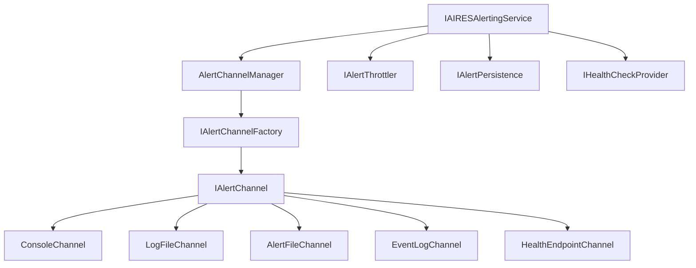

# AIRES Alerting Service Architecture Design

**Generated**: 2025-07-14 08:08:00 UTC  
**Status**: AI-Validated Design  
**Sources**: Gemini API, AIRES Booklet, Requirements Document

## Executive Summary

This document outlines the AI-validated architecture for IAIRESAlertingService, incorporating best practices from Gemini's architectural guidance and AIRES requirements.

## Architecture Overview

### Design Patterns
1. **Channel Abstraction Pattern** - Decouple alert generation from channel implementation
2. **Factory Pattern** - Create alert channels dynamically
3. **Strategy Pattern** - Allow runtime channel selection
4. **Circuit Breaker Pattern** - Resilience for failing channels

### Core Components



## Interface Definitions

### 1. Core Alerting Service
```csharp
namespace AIRES.Foundation.Alerting;

public interface IAIRESAlertingService
{
    Task RaiseAlertAsync(
        AlertSeverity severity, 
        string component, 
        string message, 
        Dictionary<string, object>? details = null);
    
    Task<HealthCheckResult> GetHealthStatusAsync();
    Task<AlertStatistics> GetAlertStatisticsAsync(TimeSpan period);
}
```

### 2. Alert Channel Abstraction
```csharp
public interface IAlertChannel : IDisposable
{
    string ChannelName { get; }
    AlertChannelType ChannelType { get; }
    bool IsEnabled { get; }
    
    Task SendAlertAsync(AlertMessage alert, CancellationToken cancellationToken = default);
    Task<bool> IsHealthyAsync();
    Task<Dictionary<string, object>> GetMetricsAsync();
}

public enum AlertChannelType
{
    Console,
    LogFile,
    AlertFile,
    WindowsEventLog,
    HealthEndpoint
}
```

### 3. Channel Factory
```csharp
public interface IAlertChannelFactory
{
    IAlertChannel CreateChannel(AlertChannelType channelType, IConfiguration configuration);
    IEnumerable<IAlertChannel> CreateAllChannels(IConfiguration configuration);
}
```

### 4. Alert Throttling
```csharp
public interface IAlertThrottler
{
    bool ShouldThrottle(string alertKey, AlertSeverity severity);
    void RecordAlert(string alertKey, AlertSeverity severity);
    Task<ThrottleStatistics> GetStatisticsAsync();
}
```

### 5. Alert Persistence
```csharp
public interface IAlertPersistence
{
    Task<AlertRecord> SaveAlertAsync(AlertMessage alert);
    Task<IEnumerable<AlertRecord>> GetAlertsAsync(AlertQuery query);
    Task<bool> AcknowledgeAlertAsync(Guid alertId, string acknowledgedBy);
}
```

## Implementation Strategy

### Phase 1: Foundation (Current)
1. Create all interface definitions
2. Implement AlertMessage and related value objects
3. Create basic channel implementations
4. Implement simple throttling

### Phase 2: Advanced Features
1. Add circuit breaker for resilient channels
2. Implement alert aggregation
3. Add metrics collection
4. Create health dashboard

### Phase 3: Integration
1. Integrate with AIRESServiceBase
2. Add CLI commands
3. Create monitoring agents
4. Add telemetry

## Channel Implementations

### 1. Console Channel
```csharp
public class ConsoleAlertChannel : IAlertChannel
{
    private readonly ConsoleColor[] _severityColors = 
    {
        ConsoleColor.Cyan,      // Information
        ConsoleColor.Yellow,    // Warning
        ConsoleColor.Red,       // Error
        ConsoleColor.DarkRed    // Critical
    };
    
    public async Task SendAlertAsync(AlertMessage alert, CancellationToken cancellationToken)
    {
        var originalColor = Console.ForegroundColor;
        try
        {
            Console.ForegroundColor = _severityColors[(int)alert.Severity];
            await Console.Out.WriteLineAsync(FormatAlert(alert));
        }
        finally
        {
            Console.ForegroundColor = originalColor;
        }
    }
}
```

### 2. Windows Event Log Channel
```csharp
public class WindowsEventLogChannel : IAlertChannel
{
    private readonly EventLog _eventLog;
    
    public WindowsEventLogChannel(IConfiguration configuration)
    {
        var sourceName = configuration["Alerting:EventLog:Source"] ?? "AIRES";
        var logName = configuration["Alerting:EventLog:LogName"] ?? "Application";
        
        if (!EventLog.SourceExists(sourceName))
        {
            EventLog.CreateEventSource(sourceName, logName);
        }
        
        _eventLog = new EventLog(logName) { Source = sourceName };
    }
    
    public async Task SendAlertAsync(AlertMessage alert, CancellationToken cancellationToken)
    {
        var eventType = alert.Severity switch
        {
            AlertSeverity.Critical => EventLogEntryType.Error,
            AlertSeverity.Error => EventLogEntryType.Error,
            AlertSeverity.Warning => EventLogEntryType.Warning,
            _ => EventLogEntryType.Information
        };
        
        await Task.Run(() => 
            _eventLog.WriteEntry(
                FormatEventLogMessage(alert), 
                eventType, 
                GetEventId(alert)), 
            cancellationToken);
    }
}
```

### 3. Health Endpoint Channel
```csharp
public class HealthEndpointChannel : IAlertChannel
{
    private readonly ConcurrentDictionary<string, ComponentHealth> _componentHealth;
    private readonly IHostingEnvironment _environment;
    
    public async Task<HealthStatus> GetHealthStatusAsync()
    {
        var unhealthyComponents = _componentHealth.Values
            .Count(c => c.Status == HealthStatus.Unhealthy);
            
        var degradedComponents = _componentHealth.Values
            .Count(c => c.Status == HealthStatus.Degraded);
            
        if (unhealthyComponents > 0)
            return new HealthStatus("unhealthy", GetHealthDetails());
        
        if (degradedComponents > 0)
            return new HealthStatus("degraded", GetHealthDetails());
            
        return new HealthStatus("healthy", GetHealthDetails());
    }
}
```

## Configuration Schema

```json
{
  "Alerting": {
    "Channels": {
      "Console": {
        "Enabled": true,
        "MinimumSeverity": "Information"
      },
      "LogFile": {
        "Enabled": true,
        "MinimumSeverity": "Information",
        "FilePath": "./logs/aires-alerts-{date}.log",
        "RetentionDays": 30
      },
      "AlertFile": {
        "Enabled": true,
        "MinimumSeverity": "Warning",
        "Directory": "./alerts/",
        "Format": "json"
      },
      "WindowsEventLog": {
        "Enabled": true,
        "MinimumSeverity": "Error",
        "Source": "AIRES",
        "LogName": "Application"
      },
      "HealthEndpoint": {
        "Enabled": true,
        "Port": 5000,
        "Path": "/health"
      }
    },
    "Throttling": {
      "Enabled": true,
      "SameAlertIntervalSeconds": 60,
      "MaxAlertsPerMinute": 10,
      "BurstSize": 20
    },
    "Persistence": {
      "Provider": "LiteDB",
      "ConnectionString": "./data/aires-alerts.db",
      "RetentionDays": 90
    }
  }
}
```

## Thread Safety Implementation

```csharp
public class AIRESAlertingService : AIRESServiceBase, IAIRESAlertingService
{
    private readonly IAlertChannelFactory _channelFactory;
    private readonly IAlertThrottler _throttler;
    private readonly IAlertPersistence _persistence;
    private readonly ImmutableList<IAlertChannel> _channels;
    private readonly SemaphoreSlim _alertSemaphore;
    
    public AIRESAlertingService(
        IAIRESLogger logger,
        IAlertChannelFactory channelFactory,
        IAlertThrottler throttler,
        IAlertPersistence persistence,
        IConfiguration configuration) 
        : base(logger, nameof(AIRESAlertingService))
    {
        _channelFactory = channelFactory;
        _throttler = throttler;
        _persistence = persistence;
        _channels = _channelFactory.CreateAllChannels(configuration).ToImmutableList();
        _alertSemaphore = new SemaphoreSlim(10, 10); // Allow 10 concurrent alerts
    }
    
    public async Task RaiseAlertAsync(
        AlertSeverity severity, 
        string component, 
        string message, 
        Dictionary<string, object>? details = null)
    {
        LogMethodEntry();
        
        await _alertSemaphore.WaitAsync();
        try
        {
            var alertKey = GenerateAlertKey(component, message);
            
            if (_throttler.ShouldThrottle(alertKey, severity))
            {
                LogDebug($"Alert throttled: {alertKey}");
                return;
            }
            
            var alert = new AlertMessage
            {
                Id = Guid.NewGuid(),
                Severity = severity,
                Component = component,
                Message = message,
                Details = details?.ToImmutableDictionary(),
                Timestamp = DateTime.UtcNow
            };
            
            // Persist first
            var record = await _persistence.SaveAlertAsync(alert);
            
            // Send to all enabled channels in parallel
            var sendTasks = _channels
                .Where(c => c.IsEnabled && c.MinimumSeverity <= severity)
                .Select(c => SendToChannelWithResilience(c, alert));
                
            await Task.WhenAll(sendTasks);
            
            _throttler.RecordAlert(alertKey, severity);
        }
        finally
        {
            _alertSemaphore.Release();
            LogMethodExit();
        }
    }
    
    private async Task SendToChannelWithResilience(IAlertChannel channel, AlertMessage alert)
    {
        try
        {
            await channel.SendAlertAsync(alert);
        }
        catch (Exception ex)
        {
            LogError($"Failed to send alert to channel {channel.ChannelName}", ex);
            // Don't throw - other channels should still receive the alert
        }
    }
}
```

## Testing Strategy

### Unit Tests Required
1. Each channel implementation
2. Throttling logic
3. Persistence layer
4. Thread safety under load
5. Configuration loading
6. Health check aggregation

### Integration Tests Required
1. Multi-channel alert delivery
2. Windows Event Log creation
3. Health endpoint HTTP responses
4. Alert file creation and rotation
5. Database persistence

## Migration Path

1. **Step 1**: Update existing ConsoleAlertingService to implement IAlertChannel
2. **Step 2**: Create channel factory and manager
3. **Step 3**: Implement remaining channels one by one
4. **Step 4**: Add throttling and persistence
5. **Step 5**: Full integration with dependency injection

## Risk Mitigation

1. **Channel Failure**: Implement circuit breaker pattern
2. **Thread Contention**: Use immutable collections and semaphores
3. **Memory Leaks**: Proper disposal of channels
4. **Performance**: Async all the way, parallel channel delivery
5. **Security**: Sanitize alert content for Event Log

---

**Status**: Ready for implementation
**Next Step**: Create interface definitions and value objects