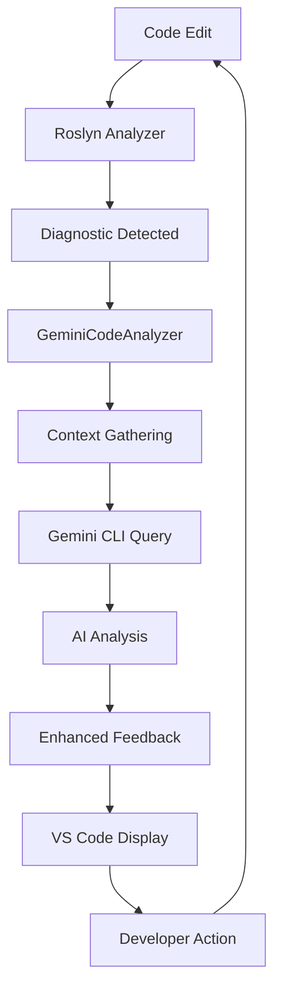

# Gemini CLI Integration Design for Real-Time Code Analysis

## Overview

This document outlines how to integrate Gemini CLI as an AI agent for real-time code analysis feedback in the TradingPlatform.CodeAnalysis system.

## Architecture

### 1. Gemini CLI as a Subprocess

Instead of HTTP API calls, we'll run Gemini CLI as a subprocess that stays alive throughout the development session:

```csharp
public class GeminiCLIService : IDisposable
{
    private Process _geminiProcess;
    private StreamWriter _geminiInput;
    private StreamReader _geminiOutput;
    private readonly string _geminiApiKey;
    
    public async Task InitializeAsync()
    {
        _geminiProcess = new Process
        {
            StartInfo = new ProcessStartInfo
            {
                FileName = "gemini",
                Arguments = "--api-key " + _geminiApiKey,
                UseShellExecute = false,
                RedirectStandardInput = true,
                RedirectStandardOutput = true,
                CreateNoWindow = true
            }
        };
        
        _geminiProcess.Start();
        _geminiInput = _geminiProcess.StandardInput;
        _geminiOutput = _geminiProcess.StandardOutput;
    }
}
```

### 2. Context-Aware Analysis

Gemini CLI can analyze the entire codebase context, not just individual diagnostics:

```csharp
public class GeminiCodeAnalyzer
{
    private readonly GeminiCLIService _gemini;
    
    public async Task<CodeAnalysisInsight> AnalyzeWithContext(
        Diagnostic diagnostic,
        string filePath,
        string surroundingCode,
        string projectContext)
    {
        var prompt = $@"
        Analyze this code issue in context:
        
        File: {filePath}
        Issue: {diagnostic.GetMessage()}
        Location: Line {diagnostic.Location.GetLineSpan().StartLinePosition.Line}
        
        Code Context:
        ```csharp
        {surroundingCode}
        ```
        
        Project Type: Day Trading Platform
        Critical Requirements:
        - Financial precision (use decimal, not double)
        - Ultra-low latency (<100μs)
        - Security (no hardcoded secrets)
        
        Questions:
        1. What is the root cause of this issue?
        2. How does it impact the trading system?
        3. What's the best fix considering performance?
        4. Are there similar issues elsewhere in the codebase?
        ";
        
        return await _gemini.QueryAsync(prompt);
    }
}
```

### 3. Real-Time Feedback Loop



### 4. Advanced Features

#### 4.1 Pattern Detection Across Codebase
```csharp
public async Task<List<SimilarIssue>> FindSimilarIssuesAsync(Diagnostic diagnostic)
{
    var prompt = $@"
    Search the codebase for similar patterns to this issue:
    {diagnostic.GetMessage()}
    
    Look for:
    - Similar code constructs
    - Same anti-patterns
    - Related security vulnerabilities
    ";
    
    return await _gemini.QueryCodebaseAsync(prompt);
}
```

#### 4.2 Automated Fix Generation
```csharp
public async Task<CodeFix> GenerateFixAsync(
    Diagnostic diagnostic,
    SyntaxNode node,
    SemanticModel model)
{
    var prompt = $@"
    Generate a fix for this issue that:
    1. Follows TradingPlatform canonical patterns
    2. Maintains ultra-low latency requirements
    3. Uses proper error handling (TradingResult<T>)
    4. Includes necessary using statements
    
    Current code:
    {node.ToFullString()}
    
    Issue: {diagnostic.GetMessage()}
    ";
    
    var fix = await _gemini.GenerateCodeAsync(prompt);
    return new CodeFix(fix);
}
```

#### 4.3 Architecture Analysis
```csharp
public async Task<ArchitectureInsight> AnalyzeArchitectureAsync(
    string componentName,
    List<Diagnostic> diagnostics)
{
    var prompt = $@"
    Analyze the architecture of {componentName}:
    
    Current issues:
    {string.Join("\n", diagnostics.Select(d => d.GetMessage()))}
    
    Check for:
    - Layer violations
    - Circular dependencies
    - Missing canonical patterns
    - Performance bottlenecks
    
    Suggest architectural improvements.
    ";
    
    return await _gemini.AnalyzeArchitectureAsync(prompt);
}
```

### 5. Integration Points

#### 5.1 VS Code Extension
```typescript
// VS Code extension integration
export class GeminiDiagnosticProvider {
    private geminiService: GeminiCLIService;
    
    async provideDiagnostics(document: TextDocument): Diagnostic[] {
        const rosylnDiagnostics = await this.getRoslynDiagnostics(document);
        
        for (const diag of rosylnDiagnostics) {
            const insight = await this.geminiService.analyzeWithContext(
                diag,
                document.uri.fsPath,
                document.getText(),
                workspace.name
            );
            
            // Enhance diagnostic with AI insights
            diag.message = `${diag.message}\n\nAI Insight: ${insight.summary}`;
            diag.relatedInformation = insight.relatedIssues;
        }
        
        return rosylnDiagnostics;
    }
}
```

#### 5.2 Build Pipeline Integration
```yaml
# Azure DevOps pipeline
- task: GeminiCodeAnalysis@1
  inputs:
    projectPath: '$(Build.SourcesDirectory)'
    geminiApiKey: '$(GeminiApiKey)'
    analysisLevel: 'deep'
    failOnCritical: true
```

### 6. Configuration

```json
{
  "geminiCLI": {
    "enabled": true,
    "apiKey": "$(GEMINI_API_KEY)",
    "contextWindow": "full", // Use full 1M token context
    "analysisDepth": "deep",
    "features": {
      "similarIssueDetection": true,
      "autoFixGeneration": true,
      "architectureAnalysis": true,
      "performanceOptimization": true,
      "securityScanning": true
    },
    "prompts": {
      "systemPrompt": "You are analyzing a high-performance day trading platform...",
      "customRules": "./gemini-rules.md"
    }
  }
}
```

### 7. Benefits Over Current Design

1. **Contextual Understanding**: Gemini can analyze the entire codebase, understanding relationships between components
2. **Interactive Debugging**: Developers can ask follow-up questions about diagnostics
3. **Pattern Recognition**: AI can identify similar issues across the codebase
4. **Automated Fixes**: Generate context-aware code fixes that follow project patterns
5. **Architecture Insights**: Deep analysis of architectural violations and suggestions
6. **Free Tier**: 1000 requests/day is sufficient for most development workflows

### 8. Implementation Plan

1. **Phase 1**: Basic Integration
   - Set up Gemini CLI subprocess management
   - Implement basic query/response handling
   - Create simple diagnostic enhancement

2. **Phase 2**: Context Enhancement
   - Add codebase context gathering
   - Implement similar issue detection
   - Create fix generation capabilities

3. **Phase 3**: Advanced Features
   - Architecture analysis
   - Performance optimization suggestions
   - Security vulnerability scanning

4. **Phase 4**: IDE Integration
   - VS Code extension with real-time feedback
   - Visual Studio integration
   - Build pipeline integration

### 9. Example Workflow

```csharp
// When a diagnostic is detected
var diagnostic = new Diagnostic(
    DiagnosticDescriptors.UseDecimalForMoney,
    location,
    "Price", "double", "decimal"
);

// Gemini analyzes with full context
var insight = await gemini.AnalyzeAsync($@"
    In a day trading platform, I found a price field using 'double' instead of 'decimal'.
    
    Code: public double Price {{ get; set; }}
    
    Considering:
    - This is financial data requiring precision
    - The system targets <100μs latency
    - Similar fields in the codebase
    
    Provide:
    1. Impact analysis
    2. Performance implications of using decimal
    3. Other similar issues to check
");

// Enhanced diagnostic with AI insight
diagnostic.Properties["AIInsight"] = insight.Summary;
diagnostic.Properties["ImpactLevel"] = insight.ImpactLevel;
diagnostic.Properties["SuggestedFix"] = insight.CodeFix;
```

### 10. GEMINI.md Integration

Create a `GEMINI.md` file in the project root to provide system context:

```markdown
# GEMINI.md - TradingPlatform Code Analysis Context

You are analyzing a high-performance day trading platform with these requirements:

## Critical Requirements
- **Latency**: <100 microseconds order-to-wire
- **Precision**: All monetary values MUST use System.Decimal
- **Security**: No hardcoded secrets, encrypted PII
- **Patterns**: All services extend CanonicalServiceBase

## Architecture
- Canonical service patterns for consistency
- TradingResult<T> for all operations
- Object pooling in hot paths
- Lock-free data structures

## When Analyzing Code
1. Consider performance impact of every suggestion
2. Ensure financial precision is maintained
3. Check for security vulnerabilities
4. Validate canonical pattern usage
5. Suggest optimizations for <100μs latency

## Common Issues to Flag
- double/float for money (use decimal)
- Allocations in hot paths
- Missing TradingResult<T> returns
- Services not extending CanonicalServiceBase
- Hardcoded secrets or connection strings
```

This approach transforms our code analysis from simple rule checking to intelligent, context-aware assistance that understands the entire system.