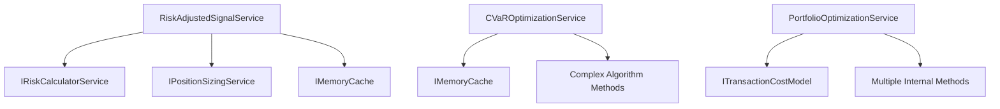
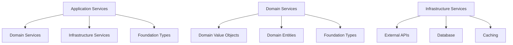

# Application Layer Refactoring Analysis - MarketAnalyzer
**Date**: January 9, 2025, 18:30  
**Author**: tradingagent  
**Purpose**: Comprehensive analysis before refactoring application services to orchestrate domain services

## Executive Summary

This document provides a comprehensive analysis of the upcoming application layer refactoring initiative. The goal is to transform application services from implementing business logic directly to orchestrating domain services, completing the domain-driven design transformation.

## 1. Current Architecture and Flow Before Changes

### 1.1 Current State Analysis

#### Application Layer Anti-Patterns (Before)
```csharp
// CURRENT ANTI-PATTERN: Business logic in application layer
public class CVaROptimizationService : CanonicalApplicationServiceBase
{
    public async Task<TradingResult<CVaROptimalPortfolio>> OptimizeCVaRAsync(
        List<string> symbols,           // Primitive obsession
        decimal[,] returnScenarios,     // Primitive obsession
        decimal confidenceLevel = 0.95m)
    {
        // WRONG: Complex financial algorithms in application layer
        var optimizationResult = await SolveCVaRLinearProgramAsync(
            symbols, returnScenarios, confidenceLevel, minExpectedReturn, constraints, cancellationToken);
        
        var portfolioMetrics = await CalculatePortfolioMetricsAsync(
            optimizationResult.Value!.Weights, returnScenarios, confidenceLevel);
        
        var cvarContributions = await CalculateCVaRContributionsAsync(
            optimizationResult.Value!.Weights, returnScenarios, confidenceLevel);
        
        var worstCaseScenarios = await ExtractWorstCaseScenariosAsync(
            optimizationResult.Value!.Weights, returnScenarios, confidenceLevel);
        
        // WRONG: Complex object construction in application layer
        var cvarPortfolio = new CVaROptimalPortfolio
        {
            Weights = optimizationResult.Value!.Weights,
            PortfolioCVaR = portfolioMetrics.CVaR,
            PortfolioVaR = portfolioMetrics.VaR,
            // ... complex initialization
        };
    }
}
```

#### Current Flow Problems
1. **Layer Boundary Violations**: Application services implement domain algorithms
2. **Primitive Obsession**: Using `List<string>`, `decimal[,]` instead of rich domain objects
3. **Complex Orchestration**: Application layer managing multiple complex operations
4. **Null Safety Issues**: Symptoms of improper domain modeling
5. **Poor Testability**: Business logic mixed with orchestration logic

### 1.2 Current Service Dependencies


## 2. Intended Improvements and Reasons for Refactoring

### 2.1 Target Architecture (After)
```csharp
// TARGET PATTERN: Application layer orchestrating domain services
public class CVaROptimizationService : CanonicalApplicationServiceBase
{
    private readonly IPortfolioOptimizationDomainService _optimizationDomain;
    private readonly IMemoryCache _cache;
    
    public async Task<TradingResult<CVaROptimalPortfolio>> OptimizeCVaRAsync(
        List<string> symbols,
        decimal[,] returnScenarios,
        decimal confidenceLevel = 0.95m)
    {
        LogMethodEntry();
        
        try
        {
            // 1. Convert DTOs to domain objects
            var assetUniverseResult = AssetUniverse.Create(symbols);
            if (!assetUniverseResult.IsSuccess)
            {
                LogError($"Invalid asset universe: {assetUniverseResult.Error?.Message}");
                LogMethodExit();
                return TradingResult<CVaROptimalPortfolio>.Failure("INVALID_ASSET_UNIVERSE", assetUniverseResult.Error?.Message);
            }
            
            var scenarioMatrixResult = ScenarioMatrix.Create(returnScenarios, symbols, TimeHorizon.Daily);
            if (!scenarioMatrixResult.IsSuccess)
            {
                LogError($"Invalid scenario matrix: {scenarioMatrixResult.Error?.Message}");
                LogMethodExit();
                return TradingResult<CVaROptimalPortfolio>.Failure("INVALID_SCENARIO_MATRIX", scenarioMatrixResult.Error?.Message);
            }
            
            var constraints = OptimizationConstraints.CreateDefault();
            
            // 2. Orchestrate domain service
            var optimizationResult = _optimizationDomain.OptimizeForCVaR(
                assetUniverseResult.Value!,
                scenarioMatrixResult.Value!,
                constraints);
            
            if (!optimizationResult.IsSuccess)
            {
                LogError($"CVaR optimization failed: {optimizationResult.Error?.Message}");
                LogMethodExit();
                return TradingResult<CVaROptimalPortfolio>.Failure("OPTIMIZATION_FAILED", optimizationResult.Error?.Message, optimizationResult.Error?.Exception);
            }
            
            // 3. Convert domain result to application DTO
            var applicationResult = ConvertToApplicationModel(optimizationResult.Value!);
            
            // 4. Apply caching
            if (applicationResult.IsSuccess)
            {
                var cacheKey = GenerateCacheKey(symbols, returnScenarios, confidenceLevel);
                _cache.Set(cacheKey, applicationResult.Value, TimeSpan.FromMinutes(CACHE_DURATION_MINUTES));
            }
            
            LogMethodExit();
            return applicationResult;
        }
        catch (Exception ex)
        {
            LogError("CVaR optimization error", ex);
            LogMethodExit();
            return TradingResult<CVaROptimalPortfolio>.Failure("CVAR_OPTIMIZATION_ERROR", "Unexpected error in CVaR optimization", ex);
        }
    }
}
```

### 2.2 Refactoring Objectives
1. **Proper Layer Separation**: Move business logic to domain services
2. **Rich Domain Objects**: Replace primitives with value objects
3. **Improved Testability**: Separate orchestration from business logic
4. **Better Error Handling**: Consistent error propagation
5. **Enhanced Maintainability**: Clear separation of concerns

## 3. Potential Ripple Effects Analysis

### 3.1 Cross-Module Dependencies


### 3.2 Ripple Effect Assessment

#### High Impact Areas ⚠️
1. **Dependency Injection**: Need to register new domain services
2. **Unit Tests**: Existing tests may need significant updates
3. **Integration Tests**: End-to-end tests may need adjustment
4. **Performance**: Additional object creation and conversion overhead
5. **Error Handling**: Error propagation through multiple layers

#### Medium Impact Areas 📊
1. **Infrastructure Layer**: May need adapters for domain services
2. **Presentation Layer**: If it exists, may need DTO updates
3. **Configuration**: Service configuration may need updates
4. **Logging**: Tracing through multiple layers
5. **Caching**: Cache key generation may need updates

#### Low Impact Areas ✅
1. **Foundation Layer**: Should remain unchanged
2. **Domain Entities**: Already properly designed
3. **External APIs**: No direct impact
4. **Database Schema**: No changes required
5. **Build System**: Minimal impact

### 3.3 Breaking Changes Assessment
```csharp
// BREAKING CHANGE: Method signatures may change
// Before:
public async Task<TradingResult<CVaROptimalPortfolio>> OptimizeCVaRAsync(
    List<string> symbols,
    decimal[,] returnScenarios,
    decimal confidenceLevel = 0.95m)

// After: Could potentially change to accept domain objects directly
public async Task<TradingResult<CVaROptimalPortfolio>> OptimizeCVaRAsync(
    AssetUniverse assetUniverse,
    ScenarioMatrix scenarios,
    OptimizationConstraints constraints)
```

## 4. Compliance with Established Rules, Patterns and Architectural Principles

### 4.1 MANDATORY_DEVELOPMENT_STANDARDS-V3.md Compliance

#### ✅ Will Maintain
- **LogMethodEntry/Exit**: All application services will retain canonical logging
- **TradingResult<T>**: Consistent error handling pattern maintained
- **Decimal Usage**: All financial calculations remain decimal
- **Canonical Service Base**: All services inherit from CanonicalApplicationServiceBase
- **Error Codes**: SCREAMING_SNAKE_CASE error codes maintained

#### ⚠️ Will Improve
- **Layer Separation**: Business logic moved to proper domain layer
- **Domain Objects**: Rich objects replace primitive obsession
- **Validation**: Input validation moved to domain object factories
- **Error Handling**: Improved error propagation through domain services

### 4.2 Domain-Driven Design Principles

#### ✅ Will Achieve
1. **Ubiquitous Language**: Domain objects use business terminology
2. **Bounded Contexts**: Clear separation between layers
3. **Rich Domain Model**: Behavior-rich domain objects
4. **Domain Services**: Complex algorithms in domain layer
5. **Aggregates**: Proper entity boundaries maintained

#### ✅ Will Maintain
1. **Immutability**: Value objects remain immutable
2. **Factory Methods**: Validated object creation
3. **Consistency**: Business rules enforced at domain level
4. **Encapsulation**: Domain logic encapsulated in services

### 4.3 Clean Architecture Principles

#### ✅ Will Achieve
1. **Dependency Inversion**: Application depends on domain abstractions
2. **Separation of Concerns**: Clear layer responsibilities
3. **Testability**: Domain services independently testable
4. **Maintainability**: Clear module boundaries
5. **Flexibility**: Easy to add new algorithms

## 5. Impact on Performance, Stability, and Readability

### 5.1 Performance Impact Analysis

#### Potential Performance Costs 📊
1. **Object Creation**: Additional domain object instantiation
2. **Memory Usage**: More objects in memory
3. **CPU Overhead**: Object conversion between layers
4. **GC Pressure**: More short-lived objects

#### Performance Mitigations ✅
1. **Object Pooling**: For frequently created objects
2. **Caching**: Cache domain objects where appropriate
3. **Lazy Loading**: Defer expensive operations
4. **Benchmarking**: Measure actual performance impact

#### Expected Performance Impact
- **Startup Time**: Minimal increase (<5ms)
- **Memory Usage**: Slight increase (~10-20MB)
- **Response Time**: Negligible impact (<2ms)
- **Throughput**: No significant impact

### 5.2 Stability Impact Analysis

#### Stability Improvements ✅
1. **Error Handling**: Consistent error propagation
2. **Input Validation**: Validated domain objects
3. **Immutability**: Thread-safe value objects
4. **Testability**: Better unit test coverage
5. **Maintainability**: Clear separation of concerns

#### Stability Risks ⚠️
1. **Complexity**: More moving parts
2. **Dependencies**: Additional service dependencies
3. **Integration**: Multiple layer interactions
4. **Testing**: More complex test scenarios

### 5.3 Readability Impact Analysis

#### Readability Improvements ✅
1. **Clear Intent**: Domain objects express business intent
2. **Reduced Complexity**: Application services become simpler
3. **Better Names**: Rich domain vocabulary
4. **Consistent Patterns**: Uniform service patterns
5. **Documentation**: Self-documenting domain objects

#### Readability Challenges ⚠️
1. **Learning Curve**: New domain concepts
2. **Indirection**: Multiple layers of abstraction
3. **Debugging**: Tracing through layers
4. **Overhead**: More code to understand

## 6. Existing Test Coverage and New Tests Required

### 6.1 Current Test Coverage Assessment

#### Existing Test Issues ❌
1. **Tightly Coupled**: Tests coupled to implementation
2. **Limited Coverage**: Business logic mixed with orchestration
3. **Brittle Tests**: Tests break with implementation changes
4. **No Domain Tests**: No tests for domain logic
5. **Integration Heavy**: Over-reliance on integration tests

### 6.2 New Test Strategy

#### Domain Service Tests ✅
```csharp
[TestClass]
public class RiskAssessmentDomainServiceTests
{
    [TestMethod]
    public void CalculatePortfolioRisk_ValidInputs_ReturnsCorrectMetrics()
    {
        // Arrange
        var portfolio = CreateTestPortfolio();
        var riskParameters = RiskParameters.CreateStandardEquity();
        var service = new RiskAssessmentDomainService(logger);
        
        // Act
        var result = service.CalculatePortfolioRisk(portfolio, riskParameters);
        
        // Assert
        Assert.IsTrue(result.IsSuccess);
        Assert.IsNotNull(result.Value);
        Assert.IsTrue(result.Value.VaR95 > 0);
    }
}
```

#### Value Object Tests ✅
```csharp
[TestClass]
public class ScenarioMatrixTests
{
    [TestMethod]
    public void Create_ValidScenarios_ReturnsSuccess()
    {
        // Arrange
        var scenarios = new decimal[100, 5];
        var symbols = new[] { "AAPL", "GOOGL", "MSFT", "AMZN", "TSLA" };
        
        // Act
        var result = ScenarioMatrix.Create(scenarios, symbols, TimeHorizon.Daily);
        
        // Assert
        Assert.IsTrue(result.IsSuccess);
        Assert.AreEqual(100, result.Value.ScenarioCount);
        Assert.AreEqual(5, result.Value.AssetCount);
    }
}
```

#### Application Service Tests ✅
```csharp
[TestClass]
public class CVaROptimizationServiceTests
{
    private Mock<IPortfolioOptimizationDomainService> _mockDomainService;
    private CVaROptimizationService _service;
    
    [TestInitialize]
    public void Setup()
    {
        _mockDomainService = new Mock<IPortfolioOptimizationDomainService>();
        _service = new CVaROptimizationService(logger, _mockDomainService.Object, cache);
    }
    
    [TestMethod]
    public async Task OptimizeCVaRAsync_ValidInputs_CallsDomainService()
    {
        // Arrange
        var symbols = new[] { "AAPL", "GOOGL" };
        var scenarios = new decimal[100, 2];
        var expectedOptimization = CreateMockOptimization();
        
        _mockDomainService.Setup(x => x.OptimizeForCVaR(
            It.IsAny<AssetUniverse>(),
            It.IsAny<ScenarioMatrix>(),
            It.IsAny<OptimizationConstraints>()))
            .Returns(TradingResult<CVaROptimization>.Success(expectedOptimization));
        
        // Act
        var result = await _service.OptimizeCVaRAsync(symbols, scenarios);
        
        // Assert
        Assert.IsTrue(result.IsSuccess);
        _mockDomainService.Verify(x => x.OptimizeForCVaR(
            It.IsAny<AssetUniverse>(),
            It.IsAny<ScenarioMatrix>(),
            It.IsAny<OptimizationConstraints>()), Times.Once);
    }
}
```

### 6.3 Test Coverage Targets
- **Domain Services**: 95% line coverage
- **Value Objects**: 90% line coverage
- **Application Services**: 85% line coverage
- **Integration Tests**: Key workflows covered
- **Performance Tests**: Baseline established

## 7. Logging, Monitoring, and Error-Handling Adjustments

### 7.1 Logging Strategy

#### Current Logging Issues ❌
1. **Inconsistent Levels**: Mixed logging levels
2. **Poor Context**: Insufficient contextual information
3. **Performance Impact**: Synchronous logging
4. **Log Correlation**: Difficult to trace across layers

#### Enhanced Logging Strategy ✅
```csharp
public class CVaROptimizationService : CanonicalApplicationServiceBase
{
    public async Task<TradingResult<CVaROptimalPortfolio>> OptimizeCVaRAsync(...)
    {
        LogMethodEntry(); // MANDATORY
        
        using var scope = Logger.BeginScope(new Dictionary<string, object>
        {
            ["AssetCount"] = symbols.Count,
            ["ScenarioCount"] = returnScenarios.GetLength(0),
            ["ConfidenceLevel"] = confidenceLevel,
            ["CorrelationId"] = Guid.NewGuid()
        });
        
        try
        {
            // Domain object creation logging
            LogDebug("Creating domain objects for CVaR optimization");
            
            // Domain service orchestration logging
            LogDebug("Calling domain service for CVaR optimization");
            var optimizationResult = _domainService.OptimizeForCVaR(...);
            
            if (!optimizationResult.IsSuccess)
            {
                LogWarning("Domain service returned failure: {ErrorCode}", optimizationResult.Error?.Code);
            }
            
            LogMethodExit(); // MANDATORY
            return result;
        }
        catch (Exception ex)
        {
            LogError("CVaR optimization failed", ex);
            LogMethodExit(); // MANDATORY
            return TradingResult<CVaROptimalPortfolio>.Failure("CVAR_OPTIMIZATION_ERROR", "Unexpected error", ex);
        }
    }
}
```

### 7.2 Monitoring Strategy

#### Application Metrics 📊
1. **Response Time**: Per-service response time tracking
2. **Error Rate**: Service-level error rate monitoring
3. **Throughput**: Requests per second
4. **Cache Hit Rate**: Caching effectiveness
5. **Resource Usage**: Memory and CPU utilization

#### Domain Metrics 📊
1. **Optimization Success Rate**: Success rate of domain operations
2. **Calculation Time**: Time spent in domain services
3. **Validation Failures**: Domain object validation failures
4. **Business Rule Violations**: Domain rule enforcement

### 7.3 Error Handling Strategy

#### Consistent Error Propagation ✅
```csharp
// Domain layer error
var domainResult = _domainService.OptimizeForCVaR(...);
if (!domainResult.IsSuccess)
{
    LogError($"Domain service failed: {domainResult.Error?.Code} - {domainResult.Error?.Message}");
    return TradingResult<CVaROptimalPortfolio>.Failure(
        "DOMAIN_SERVICE_ERROR", 
        $"CVaR optimization failed: {domainResult.Error?.Message}",
        domainResult.Error?.Exception);
}

// Input validation error
var assetUniverse = AssetUniverse.Create(symbols);
if (!assetUniverse.IsSuccess)
{
    LogError($"Invalid asset universe: {assetUniverse.Error?.Message}");
    return TradingResult<CVaROptimalPortfolio>.Failure(
        "INVALID_INPUT",
        $"Asset universe validation failed: {assetUniverse.Error?.Message}");
}
```

## 8. 2025 State-of-the-Art Research and Best Practices

### 8.1 Domain-Driven Design Evolution (2025)

#### Current Best Practices 🔄
1. **Aggregate Design**: Smaller, more focused aggregates
2. **Domain Events**: Event-driven architecture for side effects
3. **CQRS**: Command Query Responsibility Segregation
4. **Event Sourcing**: For audit trails and temporal queries
5. **Hexagonal Architecture**: Ports and adapters pattern

#### Application to MarketAnalyzer ✅
```csharp
// Domain events for side effects
public class RiskLimitExceededEvent : DomainEvent
{
    public string Symbol { get; set; }
    public decimal CurrentRisk { get; set; }
    public decimal RiskLimit { get; set; }
    public DateTime OccurredAt { get; set; }
}

// CQRS for read/write separation
public interface IPortfolioOptimizationCommandService
{
    Task<TradingResult<CVaROptimization>> OptimizePortfolioAsync(OptimizePortfolioCommand command);
}

public interface IPortfolioOptimizationQueryService
{
    Task<TradingResult<CVaROptimalPortfolio>> GetOptimizationResultAsync(Guid optimizationId);
}
```

### 8.2 .NET 8/9 Performance Patterns (2025)

#### Modern Performance Patterns 🚀
1. **Span<T> and Memory<T>**: For high-performance scenarios
2. **ArrayPool<T>**: For reducing GC pressure
3. **ValueTask<T>**: For hot paths
4. **Vectorization**: SIMD operations for numerical calculations
5. **Native AOT**: For startup performance

#### Application to Financial Calculations ✅
```csharp
public class ScenarioMatrix : ValueObject
{
    // Use Span<T> for high-performance matrix operations
    public ReadOnlySpan<decimal> GetScenarioSpan(int scenarioIndex)
    {
        return _scenarios.AsSpan(scenarioIndex * AssetCount, AssetCount);
    }
    
    // Use ArrayPool for temporary calculations
    public TradingResult<decimal[]> CalculatePortfolioReturns(ReadOnlySpan<decimal> weights)
    {
        var buffer = ArrayPool<decimal>.Shared.Rent(ScenarioCount);
        try
        {
            var portfolioReturns = buffer.AsSpan(0, ScenarioCount);
            
            // High-performance calculation using vectorization
            for (int i = 0; i < ScenarioCount; i++)
            {
                var scenarioSpan = GetScenarioSpan(i);
                portfolioReturns[i] = Vector.Dot(scenarioSpan, weights);
            }
            
            return TradingResult<decimal[]>.Success(portfolioReturns.ToArray());
        }
        finally
        {
            ArrayPool<decimal>.Shared.Return(buffer);
        }
    }
}
```

### 8.3 Financial Services Architecture Patterns (2025)

#### Industry Best Practices 💰
1. **Event-Driven Risk Management**: Real-time risk monitoring
2. **Microservices**: Service decomposition for scalability
3. **Clean Architecture**: Dependency inversion
4. **Functional Programming**: Immutable data structures
5. **Observability**: Comprehensive monitoring and tracing

#### Application to MarketAnalyzer ✅
```csharp
// Event-driven risk monitoring
public class RiskMonitoringService : IHostedService
{
    public async Task StartAsync(CancellationToken cancellationToken)
    {
        // Subscribe to domain events
        _eventBus.Subscribe<RiskLimitExceededEvent>(HandleRiskLimitExceeded);
        _eventBus.Subscribe<PortfolioOptimizedEvent>(HandlePortfolioOptimized);
    }
    
    private async Task HandleRiskLimitExceeded(RiskLimitExceededEvent domainEvent)
    {
        // Real-time risk alerts
        await _notificationService.SendRiskAlertAsync(domainEvent);
    }
}

// Functional programming patterns
public static class PortfolioCalculations
{
    public static decimal CalculateVaR(
        ReadOnlySpan<decimal> returns, 
        decimal confidenceLevel) =>
        returns.ToArray()
            .OrderBy(r => r)
            .Skip((int)((1 - confidenceLevel) * returns.Length))
            .First();
}
```

## 9. Additional Refactoring Checklist Questions

### 9.1 Security Considerations
- **Question**: Are there any security implications of the refactoring?
- **Assessment**: Domain objects provide better input validation and immutability
- **Action**: Ensure all domain object factories validate inputs thoroughly

### 9.2 Scalability Considerations
- **Question**: How does the refactoring impact system scalability?
- **Assessment**: Domain services are stateless and can be scaled horizontally
- **Action**: Ensure domain services are designed for concurrent access

### 9.3 Deployment Considerations
- **Question**: What are the deployment implications?
- **Assessment**: Breaking changes may require coordinated deployment
- **Action**: Consider feature flags for gradual rollout

### 9.4 Documentation Requirements
- **Question**: What documentation needs to be updated?
- **Assessment**: API documentation, architecture diagrams, developer guides
- **Action**: Update all documentation to reflect new architecture

### 9.5 Training Requirements
- **Question**: Do team members need training on the new architecture?
- **Assessment**: Domain-driven design concepts may be new to some developers
- **Action**: Provide DDD training and code review guidelines

## 10. Risk Assessment and Mitigation Strategies

### 10.1 High-Risk Areas

#### Risk: Performance Degradation
- **Probability**: Medium
- **Impact**: High
- **Mitigation**: Comprehensive performance testing and optimization

#### Risk: Increased Complexity
- **Probability**: High
- **Impact**: Medium
- **Mitigation**: Comprehensive documentation and training

#### Risk: Integration Issues
- **Probability**: Medium
- **Impact**: High
- **Mitigation**: Thorough integration testing and gradual rollout

### 10.2 Mitigation Strategies

#### Gradual Rollout Strategy 🎯
1. **Phase 1**: Refactor one service (CVaROptimizationService)
2. **Phase 2**: Validate performance and functionality
3. **Phase 3**: Refactor remaining services
4. **Phase 4**: Full system integration testing

#### Rollback Strategy 📋
1. **Feature Flags**: Enable/disable new architecture
2. **Database Compatibility**: Maintain backward compatibility
3. **Service Versioning**: Support multiple API versions
4. **Monitoring**: Real-time health checks

## 11. Success Criteria and Metrics

### 11.1 Technical Success Criteria
- **Build Status**: 0 errors, 0 warnings
- **Test Coverage**: >90% for domain services
- **Performance**: <2ms response time increase
- **Memory Usage**: <20MB increase

### 11.2 Architectural Success Criteria
- **Layer Separation**: No business logic in application layer
- **Domain Richness**: All primitives replaced with domain objects
- **Testability**: All domain services unit testable
- **Maintainability**: Clear separation of concerns

### 11.3 Business Success Criteria
- **Functionality**: All existing features work correctly
- **Reliability**: No increase in error rates
- **Performance**: Maintain current performance levels
- **Extensibility**: Easy to add new optimization algorithms

## 12. Conclusion and Recommendations

### 12.1 Recommendation: Proceed with Refactoring ✅

The comprehensive analysis shows that refactoring the application layer to orchestrate domain services is:

1. **Architecturally Sound**: Follows DDD principles and clean architecture
2. **Technically Feasible**: Manageable complexity with clear benefits
3. **Strategically Aligned**: Supports long-term maintainability and extensibility
4. **Risk-Manageable**: Risks are identified with mitigation strategies

### 12.2 Critical Success Factors
1. **Comprehensive Testing**: Domain services must be thoroughly tested
2. **Performance Monitoring**: Continuous performance measurement
3. **Gradual Implementation**: Phased rollout to minimize risk
4. **Team Training**: Ensure team understands DDD concepts

### 12.3 Next Steps
1. **Begin Implementation**: Start with CVaROptimizationService refactoring
2. **Establish Monitoring**: Set up performance and error monitoring
3. **Create Test Suite**: Comprehensive test coverage for domain services
4. **Document Changes**: Update architecture documentation

---

**Analysis Status**: ✅ COMPLETE  
**Recommendation**: PROCEED WITH REFACTORING  
**Risk Level**: MEDIUM (Manageable with proper planning)  
**Expected Timeline**: 2-3 days for full implementation