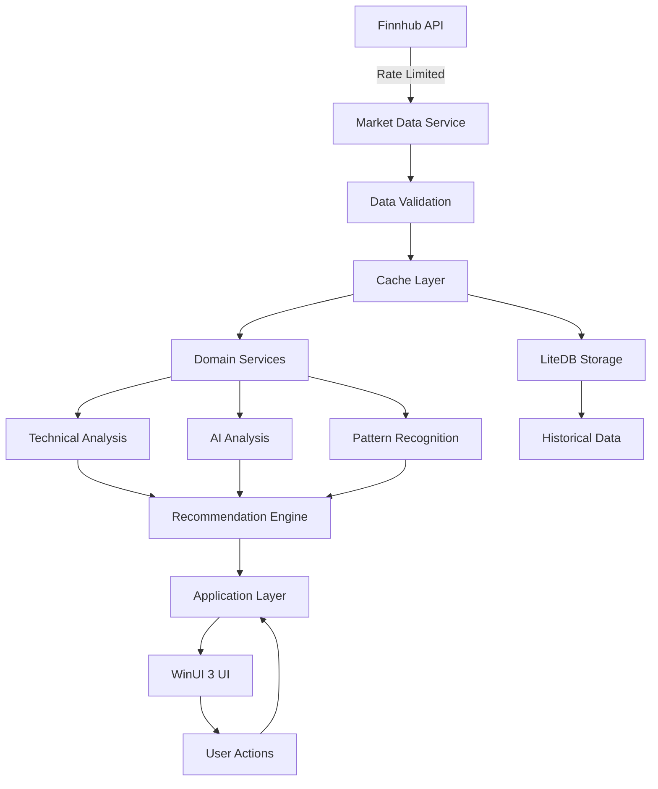

# Engineering Design Document: MarketAnalyzer
## High-Performance Day Trading Analysis & Recommendation System

**Version**: 1.0  
**Date**: July 7, 2025  
**Created**: 2025-07-07 11:47:00 PDT  
**Last Modified**: 2025-07-07 11:47:00 PDT  
**Author**: Claude (Anthropic)  
**Status**: Initial Design  
**Repository**: https://github.com/pm0code/MarketAnalyzer

---

## 1. Executive Summary

MarketAnalyzer is a high-performance, single-user desktop application for Windows 11 x64 that provides real-time market analysis, technical indicators, AI-driven insights, and trading recommendations. Built entirely in C#/.NET 8/9, it leverages modern hardware capabilities including multi-core CPUs and dual GPUs for maximum performance.

### Key Design Principles
- **Performance First**: Sub-millisecond latency for critical operations
- **Canonical Architecture**: Consistent patterns across all components
- **Hardware Optimization**: Full utilization of i9-14900K (24 cores) and dual GPUs
- **Zero Trust**: No external dependencies for core functionality
- **Observable**: Comprehensive logging and metrics at every layer

---

## 2. System Architecture

### 2.1 High-Level Architecture

```
┌─────────────────────────────────────────────────────────────────────┐
│                         MarketAnalyzer                              │
├─────────────────────────────────────────────────────────────────────┤
│  ┌─────────────────────────────────────────────────────────────┐   │
│  │                    Presentation Layer                        │   │
│  │                  MarketAnalyzer.Desktop                      │   │
│  │              (WinUI 3, MVVM, Community Toolkit)            │   │
│  └─────────────────────────────────────────────────────────────┘   │
│  ┌─────────────────────────────────────────────────────────────┐   │
│  │                    Application Layer                         │   │
│  │               MarketAnalyzer.Application                     │   │
│  │          (Use Cases, Orchestration, DTOs)                  │   │
│  └─────────────────────────────────────────────────────────────┘   │
│  ┌─────────────────────────────────────────────────────────────┐   │
│  │                      Domain Layer                           │   │
│  │                  MarketAnalyzer.Domain                      │   │
│  │        (Entities, Value Objects, Domain Services)           │   │
│  └─────────────────────────────────────────────────────────────┘   │
│  ┌─────────────────────────────────────────────────────────────┐   │
│  │                  Infrastructure Layer                        │   │
│  ├─────────────────────────────────────────────────────────────┤   │
│  │ MarketAnalyzer.Infrastructure.MarketData (Finnhub API)      │   │
│  │ MarketAnalyzer.Infrastructure.TechnicalAnalysis             │   │
│  │ MarketAnalyzer.Infrastructure.AI (ML.NET, ONNX)            │   │
│  │ MarketAnalyzer.Infrastructure.Storage (LiteDB)              │   │
│  │ MarketAnalyzer.Infrastructure.Caching (Redis/Memory)        │   │
│  └─────────────────────────────────────────────────────────────┘   │
│  ┌─────────────────────────────────────────────────────────────┐   │
│  │                    Foundation Layer                          │   │
│  │                  MarketAnalyzer.Foundation                   │   │
│  │         (Canonical Base Classes, Common Types)              │   │
│  └─────────────────────────────────────────────────────────────┘   │
└─────────────────────────────────────────────────────────────────────┘
```

### 2.2 Project Structure

```
MarketAnalyzer/
├── src/
│   ├── Foundation/
│   │   ├── MarketAnalyzer.Foundation/          # Canonical patterns, base classes
│   │   └── MarketAnalyzer.Foundation.Tests/    
│   ├── Domain/
│   │   ├── MarketAnalyzer.Domain/              # Core business logic
│   │   └── MarketAnalyzer.Domain.Tests/        
│   ├── Infrastructure/
│   │   ├── MarketAnalyzer.Infrastructure.MarketData/
│   │   ├── MarketAnalyzer.Infrastructure.TechnicalAnalysis/
│   │   ├── MarketAnalyzer.Infrastructure.AI/
│   │   ├── MarketAnalyzer.Infrastructure.Storage/
│   │   └── MarketAnalyzer.Infrastructure.Caching/
│   ├── Application/
│   │   ├── MarketAnalyzer.Application/         # Use cases, orchestration
│   │   └── MarketAnalyzer.Application.Tests/   
│   └── Presentation/
│       ├── MarketAnalyzer.Desktop/             # WinUI 3 application
│       └── MarketAnalyzer.Desktop.Tests/       
├── tests/
│   ├── MarketAnalyzer.IntegrationTests/
│   ├── MarketAnalyzer.PerformanceTests/
│   └── MarketAnalyzer.E2ETests/
├── docs/
├── scripts/
└── tools/
```

---

## 3. Core Components Design

### 3.1 Foundation Layer

#### Canonical Base Classes
```csharp
namespace MarketAnalyzer.Foundation.Canonical
{
    // Base class for all services
    public abstract class CanonicalServiceBase : IDisposable
    {
        protected ITradingLogger Logger { get; }
        protected string ServiceName { get; }
        
        protected abstract Task<TradingResult<bool>> OnInitializeAsync(CancellationToken ct);
        protected abstract Task<TradingResult<bool>> OnStartAsync(CancellationToken ct);
        protected abstract Task<TradingResult<bool>> OnStopAsync(CancellationToken ct);
        
        protected void LogMethodEntry([CallerMemberName] string methodName = "");
        protected void LogMethodExit([CallerMemberName] string methodName = "");
        protected void UpdateMetric(string metricName, double value);
    }
    
    // Result pattern for all operations
    public class TradingResult<T>
    {
        public bool IsSuccess { get; }
        public T? Value { get; }
        public TradingError? Error { get; }
        
        public static TradingResult<T> Success(T value);
        public static TradingResult<T> Failure(string errorCode, string message);
    }
}
```

### 3.2 Domain Layer

#### Core Entities
```csharp
namespace MarketAnalyzer.Domain.Entities
{
    public class Stock
    {
        public string Symbol { get; private set; }
        public string Exchange { get; private set; }
        public string Name { get; private set; }
        public MarketCap MarketCap { get; private set; }
        public Sector Sector { get; private set; }
    }
    
    public class MarketQuote
    {
        public string Symbol { get; private set; }
        public decimal CurrentPrice { get; private set; }
        public decimal DayOpen { get; private set; }
        public decimal DayHigh { get; private set; }
        public decimal DayLow { get; private set; }
        public decimal PreviousClose { get; private set; }
        public long Volume { get; private set; }
        public DateTime Timestamp { get; private set; }
        public long HardwareTimestamp { get; private set; } // For ultra-low latency
    }
    
    public class TradingRecommendation
    {
        public Guid Id { get; private set; }
        public string Symbol { get; private set; }
        public RecommendationType Type { get; private set; } // Buy, Sell, Hold
        public decimal TargetPrice { get; private set; }
        public decimal StopLoss { get; private set; }
        public decimal Confidence { get; private set; } // 0-1
        public string Rationale { get; private set; }
        public DateTime GeneratedAt { get; private set; }
        public TimeSpan ValidFor { get; private set; }
        public List<Signal> Signals { get; private set; }
    }
    
    public class Signal
    {
        public string Name { get; private set; }
        public SignalStrength Strength { get; private set; }
        public string Source { get; private set; } // "Technical", "AI", "Fundamental"
    }
}
```

#### Domain Services
```csharp
namespace MarketAnalyzer.Domain.Services
{
    public interface IRecommendationEngine
    {
        Task<TradingResult<TradingRecommendation>> GenerateRecommendationAsync(
            string symbol, 
            AnalysisContext context,
            CancellationToken ct);
    }
    
    public interface IMarketAnalysisService
    {
        Task<TradingResult<MarketAnalysis>> AnalyzeMarketAsync(
            List<string> symbols,
            TimeFrame timeFrame,
            CancellationToken ct);
    }
}
```

### 3.3 Infrastructure Layer

#### Market Data Service (Finnhub Integration)
```csharp
namespace MarketAnalyzer.Infrastructure.MarketData
{
    public class FinnhubMarketDataService : CanonicalServiceBase, IMarketDataService
    {
        private readonly HttpClient _httpClient;
        private readonly Channel<ApiRequest> _rateLimiter;
        private readonly IMemoryCache _cache;
        
        // Rate limiting: 60 calls/minute, 30 calls/second burst
        private const int MaxCallsPerMinute = 60;
        private const int MaxCallsPerSecond = 30;
        
        public async Task<TradingResult<MarketQuote>> GetQuoteAsync(
            string symbol, 
            CancellationToken ct)
        {
            LogMethodEntry();
            
            // Check cache first
            if (_cache.TryGetValue<MarketQuote>($"quote:{symbol}", out var cached))
            {
                LogMethodExit();
                return TradingResult<MarketQuote>.Success(cached);
            }
            
            // Rate-limited API call
            var request = new ApiRequest { /* ... */ };
            await _rateLimiter.Writer.WriteAsync(request, ct);
            
            // Make API call with retry policy
            // Parse response
            // Update cache
            // Return result
        }
        
        public async Task<IAsyncEnumerable<MarketTick>> StreamQuotesAsync(
            List<string> symbols,
            CancellationToken ct)
        {
            // WebSocket implementation for real-time data
        }
    }
}
```

#### Technical Analysis Service
```csharp
namespace MarketAnalyzer.Infrastructure.TechnicalAnalysis
{
    public class TechnicalAnalysisService : CanonicalServiceBase, ITechnicalAnalysisService
    {
        // Leverages Skender.Stock.Indicators
        
        public async Task<TradingResult<TechnicalIndicators>> CalculateIndicatorsAsync(
            string symbol,
            List<Quote> historicalData,
            IndicatorConfig config,
            CancellationToken ct)
        {
            LogMethodEntry();
            
            // Parallel calculation of indicators
            var tasks = new[]
            {
                Task.Run(() => historicalData.GetSma(20)),
                Task.Run(() => historicalData.GetRsi(14)),
                Task.Run(() => historicalData.GetMacd()),
                Task.Run(() => historicalData.GetBollingerBands())
            };
            
            await Task.WhenAll(tasks);
            
            // Aggregate results
            // Return comprehensive indicator set
        }
    }
}
```

#### AI/ML Service
```csharp
namespace MarketAnalyzer.Infrastructure.AI
{
    public class AIAnalysisService : CanonicalServiceBase, IAIAnalysisService
    {
        private readonly InferenceSession _onnxSession;
        private readonly MLContext _mlContext;
        private readonly IGpuAccelerator _gpuAccelerator;
        
        protected override async Task<TradingResult<bool>> OnInitializeAsync(CancellationToken ct)
        {
            // Initialize ONNX with GPU support
            var gpuOptions = SessionOptions.MakeSessionOptionWithCudaProvider(0);
            _onnxSession = new InferenceSession(modelPath, gpuOptions);
            
            // Initialize ML.NET
            _mlContext = new MLContext(seed: 42);
            
            return TradingResult<bool>.Success(true);
        }
        
        public async Task<TradingResult<AIPrediction>> PredictAsync(
            MarketSnapshot snapshot,
            CancellationToken ct)
        {
            // GPU-accelerated inference
            return await _gpuAccelerator.RunAsync(gpu =>
            {
                // Prepare tensors
                // Run inference
                // Process results
            });
        }
    }
}
```

### 3.4 Application Layer

#### Use Cases
```csharp
namespace MarketAnalyzer.Application.UseCases
{
    public class GenerateRecommendationUseCase : IUseCase<GenerateRecommendationRequest, TradingRecommendation>
    {
        private readonly IMarketDataService _marketData;
        private readonly ITechnicalAnalysisService _technicalAnalysis;
        private readonly IAIAnalysisService _aiAnalysis;
        private readonly IRecommendationEngine _recommendationEngine;
        
        public async Task<TradingResult<TradingRecommendation>> ExecuteAsync(
            GenerateRecommendationRequest request,
            CancellationToken ct)
        {
            // 1. Fetch current market data
            var marketData = await _marketData.GetQuoteAsync(request.Symbol, ct);
            
            // 2. Get historical data for technical analysis
            var historicalData = await _marketData.GetHistoricalAsync(request.Symbol, ct);
            
            // 3. Calculate technical indicators
            var indicators = await _technicalAnalysis.CalculateIndicatorsAsync(
                request.Symbol, historicalData, ct);
            
            // 4. Run AI predictions
            var aiPrediction = await _aiAnalysis.PredictAsync(
                new MarketSnapshot { /* ... */ }, ct);
            
            // 5. Generate recommendation
            var context = new AnalysisContext
            {
                MarketData = marketData.Value,
                Indicators = indicators.Value,
                AIPrediction = aiPrediction.Value
            };
            
            return await _recommendationEngine.GenerateRecommendationAsync(
                request.Symbol, context, ct);
        }
    }
}
```

### 3.5 Presentation Layer

#### WinUI 3 MVVM Implementation
```csharp
namespace MarketAnalyzer.Desktop.ViewModels
{
    public partial class MainViewModel : ObservableObject
    {
        private readonly IMediator _mediator;
        
        [ObservableProperty]
        private ObservableCollection<TradingRecommendation> _recommendations;
        
        [ObservableProperty]
        private ObservableCollection<MarketQuote> _watchlist;
        
        [RelayCommand]
        private async Task GenerateRecommendationAsync(string symbol)
        {
            var result = await _mediator.Send(new GenerateRecommendationRequest(symbol));
            
            if (result.IsSuccess)
            {
                Recommendations.Add(result.Value);
            }
        }
        
        [RelayCommand]
        private async Task StartRealTimeMonitoringAsync()
        {
            await foreach (var tick in _marketData.StreamQuotesAsync(WatchlistSymbols))
            {
                // Update UI with real-time data
                DispatcherQueue.TryEnqueue(() =>
                {
                    UpdateQuote(tick);
                });
            }
        }
    }
}
```

---

## 4. Performance Optimization Strategy

### 4.1 CPU Optimization
- **Thread Affinity**: Pin critical threads to P-cores
- **SIMD Operations**: Use Vector<T> for bulk calculations
- **Parallel Processing**: Leverage all 24 cores for batch operations
- **Lock-Free Collections**: ConcurrentQueue, ConcurrentBag where applicable

### 4.2 GPU Acceleration
- **Primary GPU (RTX 4070 Ti)**: AI model inference, complex calculations
- **Secondary GPU (RTX 3060 Ti)**: Parallel backtesting, auxiliary computations
- **CUDA Streams**: Concurrent execution of independent operations
- **Tensor Cores**: Leverage for matrix operations in AI models

### 4.3 Memory Management
- **Object Pooling**: ArrayPool<T> for frequently allocated arrays
- **Span<T> Usage**: Zero-copy operations for performance-critical paths
- **Memory-Mapped Files**: For large historical datasets
- **Large Pages**: Enable for improved TLB efficiency

### 4.4 Storage Optimization
- **Hot Data**: NVMe SSD with memory caching
- **Warm Data**: Local SSD with LiteDB
- **Cold Data**: NAS for historical archives
- **Write-Ahead Logging**: For transaction safety

---

## 5. Data Flow Architecture



---

## 6. Security Architecture

### 6.1 API Key Management
```csharp
public class SecureConfiguration
{
    public string GetApiKey(string provider)
    {
        var encryptedKey = File.ReadAllBytes($"{provider}.key");
        return Encoding.UTF8.GetString(
            ProtectedData.Unprotect(encryptedKey, null, DataProtectionScope.CurrentUser)
        );
    }
}
```

### 6.2 Local Security
- Windows Credential Manager for sensitive data
- Encrypted local storage for user preferences
- No network exposure (single-user application)
- Audit logging for compliance

---

## 7. Error Handling and Resilience

### 7.1 Circuit Breaker Pattern
```csharp
public class CircuitBreaker<T>
{
    private readonly int _threshold;
    private readonly TimeSpan _timeout;
    private int _failureCount;
    private DateTime _lastFailureTime;
    private CircuitState _state = CircuitState.Closed;
    
    public async Task<TradingResult<T>> ExecuteAsync(Func<Task<T>> action)
    {
        if (_state == CircuitState.Open && 
            DateTime.UtcNow - _lastFailureTime < _timeout)
        {
            return TradingResult<T>.Failure("CIRCUIT_OPEN", "Circuit breaker is open");
        }
        
        try
        {
            var result = await action();
            Reset();
            return TradingResult<T>.Success(result);
        }
        catch (Exception ex)
        {
            RecordFailure();
            return TradingResult<T>.Failure("CIRCUIT_FAILURE", ex.Message);
        }
    }
}
```

### 7.2 Retry Policy
```csharp
public class RetryPolicy
{
    public static IAsyncPolicy<HttpResponseMessage> GetHttpRetryPolicy()
    {
        return HttpPolicyExtensions
            .HandleTransientHttpError()
            .WaitAndRetryAsync(
                3,
                retryAttempt => TimeSpan.FromSeconds(Math.Pow(2, retryAttempt)),
                onRetry: (outcome, timespan, retryCount, context) =>
                {
                    Log.Warning("Retry {RetryCount} after {Timespan}s", retryCount, timespan.TotalSeconds);
                });
    }
}
```

---

## 8. Testing Strategy

### 8.1 Unit Testing
- xUnit for test framework
- FluentAssertions for readable assertions
- Moq for mocking
- 90% code coverage target

### 8.2 Integration Testing
- TestContainers for external dependencies
- In-memory databases for storage tests
- WebApplicationFactory for API tests

### 8.3 Performance Testing
- BenchmarkDotNet for micro-benchmarks
- NBomber for load testing
- Custom harness for latency measurements

### 8.4 E2E Testing
- WinAppDriver for UI automation
- Scenario-based testing
- Performance regression tests

---

## 9. Deployment Architecture

### 9.1 Installer
- WiX Toolset for MSI creation
- Automatic updates via Squirrel.Windows
- Prerequisites check (VC++ redistributables, .NET runtime)

### 9.2 Configuration
```json
{
  "MarketAnalyzer": {
    "DataProviders": {
      "Finnhub": {
        "ApiKey": "encrypted_key_here",
        "RateLimit": {
          "CallsPerMinute": 60,
          "CallsPerSecond": 30
        }
      }
    },
    "Performance": {
      "EnableGpuAcceleration": true,
      "PrimaryGpuIndex": 0,
      "SecondaryGpuIndex": 1,
      "ThreadPoolSize": 24
    }
  }
}
```

---

## 10. Monitoring and Observability

### 10.1 Structured Logging
```csharp
Log.Information("Recommendation generated {Symbol} {Type} {Confidence:P2}",
    recommendation.Symbol,
    recommendation.Type,
    recommendation.Confidence);
```

### 10.2 Performance Counters
- API response times
- Model inference latency
- Cache hit rates
- Memory usage
- GPU utilization

### 10.3 Health Checks
```csharp
public class HealthCheckService
{
    public async Task<HealthStatus> CheckHealthAsync()
    {
        var checks = new[]
        {
            CheckApiConnectivity(),
            CheckGpuAvailability(),
            CheckDiskSpace(),
            CheckMemoryUsage()
        };
        
        var results = await Task.WhenAll(checks);
        return AggregateHealth(results);
    }
}
```

---

## 11. Development Standards

### 11.1 Coding Standards
- Follow C# naming conventions
- Use nullable reference types
- Implement IDisposable properly
- Use async/await throughout

### 11.2 Canonical Patterns
- All services inherit from CanonicalServiceBase
- All methods use LogMethodEntry/Exit
- All operations return TradingResult<T>
- All financial values use decimal type

### 11.3 Documentation
- XML documentation for all public APIs
- README for each project
- Architecture Decision Records (ADRs)
- Comprehensive inline comments

---

## 12. Future Considerations

### 12.1 Scalability Path
- Multi-user support via web API
- Cloud deployment options
- Distributed computing for backtesting

### 12.2 Additional Features
- Options analytics
- Crypto market support
- Social sentiment analysis
- News integration

### 12.3 Technology Updates
- .NET 9 migration
- MAUI for cross-platform
- Blazor for web interface

---

## Appendices

### A. Technology Stack Summary
| Component | Technology | Version |
|-----------|------------|---------|
| Framework | .NET 8/9 | Latest |
| UI | WinUI 3 | 1.5+ |
| MVVM | Community Toolkit | 8.2+ |
| Market Data | Finnhub API | v1 |
| Technical Analysis | Skender.Stock.Indicators | 2.6+ |
| ML Framework | ML.NET | 3.0+ |
| AI Runtime | ONNX Runtime | 1.16+ |
| Database | LiteDB | 5.0+ |
| Caching | Microsoft.Extensions.Caching | 8.0+ |
| Logging | Serilog | 3.1+ |
| Charts | LiveCharts2, ScottPlot | Latest |

### B. Hardware Requirements
- CPU: Intel Core i9-14900K or equivalent
- RAM: 32GB DDR5 (64GB recommended)
- GPU: NVIDIA RTX 4070 Ti + RTX 3060 Ti
- Storage: 1TB NVMe SSD
- OS: Windows 11 x64

### C. References
- [Finnhub API Documentation](https://finnhub.io/docs/api)
- [WinUI 3 Documentation](https://docs.microsoft.com/windows/apps/winui/winui3/)
- [ML.NET Documentation](https://docs.microsoft.com/dotnet/machine-learning/)
- [ONNX Runtime Documentation](https://onnxruntime.ai/docs/)

---

**Document Version Control**
- v1.0 - Initial Design (July 7, 2025)