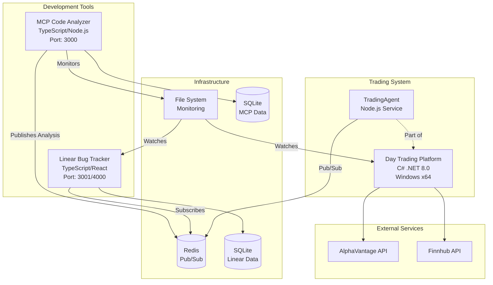

# Architecture Improvements Proposal

## Executive Summary

This document proposes improvements to the three-project ecosystem (DayTradingPlatform, MCP Code Analyzer, Linear Bug Tracker) to enhance integration, maintainability, and documentation.

## Proposed Improvements

### 1. Update TradingAgent with 'agent' Field (Priority: HIGH)

**Issue**: AgentHub displays messages from TradingAgent as "unknown" due to missing 'agent' field.

**Solution**: Update the message format in `tradingagent-redis.js` to include the 'agent' field.

**Changes Required**:
```javascript
// In sendMessage method, update the message object:
const message = {
    agent: this.agentName,      // ADD THIS LINE
    from: this.agentName,
    to: channel.split(':')[0],
    type: type,
    subject: subject,
    message: content,
    timestamp: new Date().toISOString(),
    metadata: {
        priority: metadata.priority || 'medium',
        requires_response: metadata.requires_response || false,
        correlation_id: metadata.correlation_id || `${this.agentName}-${Date.now()}-${Math.random().toString(36).substr(2, 9)}`,
        ...metadata
    }
};
```

**Files to Update**:
- `/home/nader/my_projects/CS/DayTradingPlatform/scripts/tradingagent-redis.js`

### 2. Create Shared Configuration Repository (Priority: MEDIUM)

**Purpose**: Centralize common configurations and types shared across all three projects.

**Proposed Structure**:
```
/home/nader/my_projects/CS/shared-config/
├── README.md
├── package.json
├── src/
│   ├── messages/
│   │   ├── types.ts           # Common message type definitions
│   │   ├── schemas.json       # JSON schemas for validation
│   │   └── examples.json      # Example messages
│   ├── integration/
│   │   ├── endpoints.json     # API endpoints for all services
│   │   ├── channels.json      # Redis channel definitions
│   │   └── protocols.md       # Communication protocols
│   └── constants/
│       ├── error-codes.json   # Standardized error codes
│       └── priorities.json    # Priority definitions
├── scripts/
│   └── validate-config.js     # Validation script
└── docs/
    └── usage-guide.md
```

**Benefits**:
- Single source of truth for integration contracts
- Type safety for TypeScript projects
- Easier to maintain consistency
- Version-controlled changes

**Implementation Steps**:
1. Create new repository structure
2. Extract common types from existing projects
3. Create npm package for TypeScript projects
4. Create NuGet package for C# project (optional)
5. Update all projects to use shared configurations

### 3. Architecture Documentation (Priority: MEDIUM)

#### 3.1 Architecture Diagram

**Proposed Diagram Structure** (Mermaid format):


**File Location**: `/home/nader/my_projects/CS/DayTradingPlatform/docs/architecture/system-overview.md`

#### 3.2 Integration Points Documentation

**Proposed Documentation Structure**:

```markdown
# System Integration Documentation

## Overview
This document describes all integration points between the three core systems.

## 1. MCP Code Analyzer Integration

### 1.1 File System Monitoring
- **Monitored Paths**:
  - `/home/nader/my_projects/CS/DayTradingPlatform/**/*.cs`
  - `/home/nader/my_projects/CS/linear-bug-tracker/**/*.ts`
- **Events**: File changes, additions, deletions
- **Frequency**: Real-time with debouncing

### 1.2 Redis Publishing
- **Channel**: `mcp:analysis`
- **Message Format**: See shared-config/messages/types.ts
- **Frequency**: On analysis completion

## 2. Linear Bug Tracker Integration

### 2.1 MCP Subscription
- **Channels**: `mcp:*`, `bug:*`
- **Actions**: Auto-create issues from critical findings
- **Priority Mapping**: Based on severity

### 2.2 Redis Publishing
- **Channels**: `linear:updates`, `bug:status`
- **Events**: Issue creation, status changes, assignments

## 3. Trading Platform Integration

### 3.1 TradingAgent Communication
- **Identity**: `tradingagent`
- **Channels**: `tradingagent:*`, `agent:*`, `alert:*`
- **Capabilities**: Market data, trading status, risk assessment

### 3.2 MCP Analysis
- **Focus Areas**: Financial precision, decimal usage, performance
- **Critical Rules**: No float/double for money, async patterns
```

**File Location**: `/home/nader/my_projects/CS/DayTradingPlatform/docs/integration/README.md`

### 4. Implementation Timeline

**Phase 1: Immediate (Day 1)**
- Update TradingAgent with 'agent' field
- Test message display in AgentHub

**Phase 2: Short-term (Days 2-3)**
- Create shared configuration repository structure
- Extract common types and schemas
- Create initial documentation

**Phase 3: Medium-term (Days 4-7)**
- Create architecture diagrams
- Complete integration documentation
- Update all projects to use shared configs
- Run integration tests

## Testing Plan

### 1. TradingAgent Update
```bash
# Test updated message format
redis-cli MONITOR  # In one terminal

# In another terminal
node /home/nader/my_projects/CS/DayTradingPlatform/scripts/tradingagent-redis.js

# Verify 'agent' field appears in messages
```

### 2. Shared Configuration
```bash
# Validate all message formats
node shared-config/scripts/validate-config.js

# Test TypeScript imports
npm test  # In each TypeScript project
```

### 3. Documentation
- Review all diagrams render correctly
- Verify all links work
- Confirm examples are accurate

## Risk Assessment

**Low Risk**:
- Adding 'agent' field is backward compatible
- Documentation changes have no runtime impact

**Medium Risk**:
- Shared configuration requires updating dependencies
- Need to ensure all projects stay in sync

**Mitigation**:
- Incremental rollout
- Comprehensive testing
- Version locking for shared configs

## Approval Checklist

Please review and approve the following:

- [ ] TradingAgent message format update
- [ ] Shared configuration repository structure
- [ ] Architecture diagram design
- [ ] Integration documentation outline
- [ ] Implementation timeline
- [ ] Testing approach

## Next Steps

Upon approval:
1. Implement Phase 1 immediately
2. Create shared-config repository
3. Begin documentation efforts
4. Schedule integration testing

---

*Prepared by: TradingAgent (Claude Code)*  
*Date: 2025-01-30*  
*Version: 1.0*