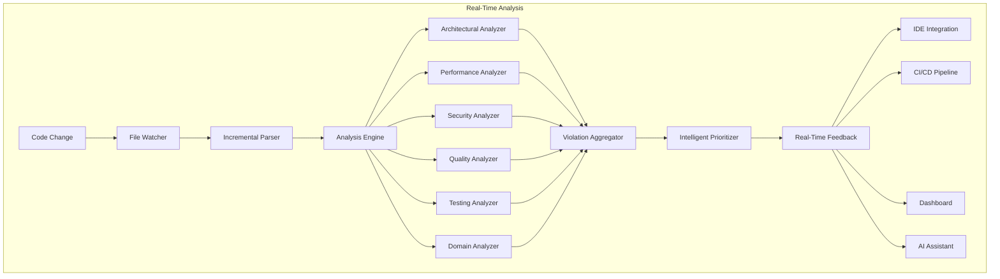

# MCP Code Analysis Server - Comprehensive Analysis Aspects

## Core Analysis Categories

### 1. Architectural Compliance

```typescript
interface IArchitecturalAnalyzer {
  // Canonical Patterns
  checkCanonicalImplementation(): CanonicalViolation[];
  validateServiceBase(): ServiceBaseViolation[];
  enforceLifecycleMethods(): LifecycleViolation[];
  
  // Modular Design
  detectModularityViolations(): ModularityIssue[];
  checkLayerSeparation(): LayerViolation[];
  validateDependencyDirection(): DependencyIssue[];
  findCircularDependencies(): CircularDependency[];
  
  // Design Patterns
  validatePatternImplementation(): PatternViolation[];
  checkSingletonUsage(): SingletonIssue[];
  validateFactoryPatterns(): FactoryIssue[];
  enforceStrategyPattern(): StrategyViolation[];
  
  // Component Isolation
  checkComponentBoundaries(): BoundaryViolation[];
  validateInterfaceSegregation(): InterfaceIssue[];
  enforceDependencyInversion(): DIPViolation[];
}

// Canonical Pattern Rules
const canonicalRules: IRule[] = [
  {
    id: "ARCH001",
    name: "Service must extend CanonicalServiceBase",
    implementation: {
      type: "ast",
      visitor: new CanonicalServiceChecker()
    }
  },
  {
    id: "ARCH002", 
    name: "Must implement IInitializable lifecycle",
    implementation: {
      type: "semantic",
      analyzer: new LifecycleAnalyzer()
    }
  },
  {
    id: "ARCH003",
    name: "Must use TradingResult<T> for operations",
    implementation: {
      type: "semantic",
      analyzer: new ResultPatternAnalyzer()
    }
  }
];
```

### 2. Performance & Scalability

```typescript
interface IPerformanceAnalyzer {
  // Latency Analysis
  detectHotPaths(): HotPath[];
  measureMethodComplexity(): ComplexityMetric[];
  findBlockingOperations(): BlockingOperation[];
  identifyLatencyBottlenecks(): LatencyIssue[];
  
  // Memory & Allocation
  detectMemoryLeaks(): MemoryLeak[];
  findExcessiveAllocations(): AllocationIssue[];
  checkObjectPoolingUsage(): PoolingViolation[];
  validateStackAllocation(): StackAllocationIssue[];
  
  // Scalability
  analyzeThreadSafety(): ThreadSafetyIssue[];
  checkLockContention(): LockContention[];
  validateAsyncPatterns(): AsyncViolation[];
  findScalabilityBottlenecks(): ScalabilityIssue[];
  
  // Resource Usage
  checkResourceDisposal(): DisposalIssue[];
  validateConnectionPooling(): PoolingIssue[];
  analyzeQueryPerformance(): QueryPerformance[];
  checkCacheEffectiveness(): CacheIssue[];
}

const performanceRules: IRule[] = [
  {
    id: "PERF001",
    name: "No allocations in hot paths",
    metadata: {
      hotPathMarkers: ["HotPath", "PerformanceCritical", "LowLatency"],
      maxLatencyMs: 0.1
    }
  },
  {
    id: "PERF002",
    name: "Use ValueTask in high-frequency async",
    metadata: {
      threshold: 1000 // calls per second
    }
  },
  {
    id: "PERF003",
    name: "Require object pooling for frequent allocations",
    metadata: {
      allocationThreshold: 100 // per second
    }
  }
];
```

### 3. Code Quality & Maintainability

```typescript
interface ICodeQualityAnalyzer {
  // Complexity Metrics
  calculateCyclomaticComplexity(): ComplexityScore[];
  measureCognitiveComplexity(): CognitiveScore[];
  checkMethodLength(): MethodLengthIssue[];
  validateClassCohesion(): CohesionMetric[];
  
  // Maintainability
  calculateMaintainabilityIndex(): MaintainabilityScore;
  detectCodeSmells(): CodeSmell[];
  findDuplicateCode(): DuplicationIssue[];
  checkNamingConventions(): NamingViolation[];
  
  // Documentation
  validateXmlDocumentation(): DocViolation[];
  checkCommentQuality(): CommentIssue[];
  enforceApiDocumentation(): ApiDocIssue[];
  validateExampleCode(): ExampleIssue[];
  
  // Readability
  checkCodeFormatting(): FormattingIssue[];
  validateIndentation(): IndentationIssue[];
  enforceStyleGuidelines(): StyleViolation[];
  checkLineLength(): LineLengthIssue[];
}
```

### 4. Security & Compliance

```typescript
interface ISecurityAnalyzer {
  // Vulnerability Detection
  findSqlInjection(): SqlInjectionIssue[];
  detectXssVulnerabilities(): XssIssue[];
  checkPathTraversal(): PathTraversalIssue[];
  findHardcodedSecrets(): SecretIssue[];
  
  // Cryptography
  validateCryptoUsage(): CryptoIssue[];
  checkKeyManagement(): KeyManagementIssue[];
  enforceSecureRandom(): RandomIssue[];
  validateTlsConfiguration(): TlsIssue[];
  
  // Access Control
  checkAuthentication(): AuthIssue[];
  validateAuthorization(): AuthzIssue[];
  enforcePrivilegeEscalation(): PrivilegeIssue[];
  checkSessionManagement(): SessionIssue[];
  
  // Data Protection
  validatePiiHandling(): PiiIssue[];
  checkDataEncryption(): EncryptionIssue[];
  enforceSecureStorage(): StorageIssue[];
  validateDataSanitization(): SanitizationIssue[];
}

const securityRules: IRule[] = [
  {
    id: "SEC001",
    name: "No hardcoded credentials",
    severity: "error",
    metadata: {
      patterns: ["password", "apikey", "secret", "token"],
      excludePaths: ["test", "example"]
    }
  },
  {
    id: "SEC002",
    name: "Use parameterized queries",
    severity: "error",
    metadata: {
      sqlMethods: ["ExecuteQuery", "ExecuteScalar", "ExecuteNonQuery"]
    }
  }
];
```

### 5. Testing & Coverage

```typescript
interface ITestingAnalyzer {
  // Test Coverage
  calculateLineCoverage(): CoverageMetric;
  measureBranchCoverage(): BranchCoverage;
  checkMethodCoverage(): MethodCoverage;
  validateMutationCoverage(): MutationScore;
  
  // Test Quality
  detectTestSmells(): TestSmell[];
  checkTestIsolation(): IsolationIssue[];
  validateTestNaming(): TestNamingIssue[];
  enforceArrangeActAssert(): AaaViolation[];
  
  // Test Patterns
  checkUnitTestPatterns(): UnitTestIssue[];
  validateIntegrationTests(): IntegrationIssue[];
  enforceTestDataBuilders(): BuilderIssue[];
  checkMockUsage(): MockingIssue[];
}
```

### 6. Domain-Specific Rules

```typescript
interface IDomainAnalyzer {
  // Financial Precision (for trading platform)
  enforceDecimalForMoney(): PrecisionIssue[];
  validateFinancialCalculations(): CalcIssue[];
  checkRoundingRules(): RoundingIssue[];
  enforceMoneyPatterns(): MoneyPatternIssue[];
  
  // Business Logic
  validateBusinessRules(): BusinessRuleViolation[];
  checkDomainInvariants(): InvariantViolation[];
  enforceValueObjects(): ValueObjectIssue[];
  validateAggregateRules(): AggregateIssue[];
  
  // Industry Standards
  checkRegulatoryCompliance(): ComplianceIssue[];
  validateAuditTrail(): AuditIssue[];
  enforceDataRetention(): RetentionIssue[];
  checkReportingRequirements(): ReportingIssue[];
}

// Example: Trading Platform Specific Rules
const tradingRules: IRule[] = [
  {
    id: "TRADE001",
    name: "Use decimal for all monetary values",
    severity: "error",
    implementation: {
      type: "semantic",
      analyzer: new MonetaryPrecisionAnalyzer()
    }
  },
  {
    id: "TRADE002",
    name: "Latency must be <100μs for order execution",
    severity: "error",
    metadata: {
      performanceProfile: "ultra-low-latency",
      maxLatencyMicros: 100
    }
  }
];
```

### 7. Dependency Management

```typescript
interface IDependencyAnalyzer {
  // Version Control
  checkDependencyVersions(): VersionIssue[];
  findOutdatedPackages(): OutdatedPackage[];
  validateVersionCompatibility(): CompatibilityIssue[];
  detectVersionConflicts(): ConflictIssue[];
  
  // Security
  scanVulnerabilities(): Vulnerability[];
  checkLicenseCompliance(): LicenseIssue[];
  validateDependencySource(): SourceIssue[];
  enforceApprovedPackages(): ApprovalIssue[];
  
  // Architecture
  checkDependencyLayers(): LayerViolation[];
  validatePackageBoundaries(): BoundaryIssue[];
  findUnusedDependencies(): UnusedDependency[];
  detectTransitiveDependencies(): TransitiveIssue[];
}
```

### 8. Real-Time Monitoring

```typescript
interface IRealTimeMonitor {
  // File System Events
  onFileChanged(handler: FileChangeHandler): void;
  onFileCreated(handler: FileCreateHandler): void;
  onFileDeleted(handler: FileDeleteHandler): void;
  
  // Code Events
  onMethodAdded(handler: MethodHandler): void;
  onClassModified(handler: ClassHandler): void;
  onImportChanged(handler: ImportHandler): void;
  
  // Violation Tracking
  trackViolations(): ViolationStream;
  aggregateMetrics(): MetricsStream;
  detectTrends(): TrendAnalysis;
  predictIssues(): PredictedIssue[];
}

class RealTimeAnalysisEngine {
  private fileWatcher: FileWatcher;
  private analysisQueue: PriorityQueue<AnalysisTask>;
  private violationCache: LRUCache<Violation>;
  
  async start() {
    // Watch for file changes
    this.fileWatcher.on("change", async (file) => {
      // Incremental analysis
      const analysis = await this.incrementalAnalyze(file);
      
      // Real-time feedback
      this.broadcastResults(analysis);
      
      // Update violation tracking
      this.updateViolationCache(analysis);
      
      // Trigger dependent analyses
      await this.cascadeAnalysis(file);
    });
  }
  
  private async incrementalAnalyze(file: File) {
    // Only analyze what changed
    const diff = await this.getDiff(file);
    const affectedMethods = this.identifyAffectedMethods(diff);
    
    // Run all analyzers on affected code
    return Promise.all([
      this.architecturalAnalyzer.analyze(affectedMethods),
      this.performanceAnalyzer.analyze(affectedMethods),
      this.securityAnalyzer.analyze(affectedMethods),
      this.qualityAnalyzer.analyze(affectedMethods)
    ]);
  }
}
```

### 9. Comprehensive Rule Configuration

```yaml
# Complete rule configuration
rules:
  # Architectural Rules
  architecture:
    canonical-patterns:
      enabled: true
      severity: error
      patterns:
        - service-base
        - repository-base
        - lifecycle-methods
        - result-pattern
    
    modular-design:
      enabled: true
      layer-enforcement: strict
      dependency-direction: inward
      circular-dependencies: forbidden
  
  # Performance Rules
  performance:
    latency:
      hot-path-threshold: 100μs
      allocation-limit: 0
      gc-pressure: minimal
    
    scalability:
      thread-safety: required
      async-patterns: enforced
      connection-pooling: mandatory
  
  # Security Rules
  security:
    vulnerabilities:
      sql-injection: blocked
      xss-prevention: enforced
      path-traversal: prevented
    
    cryptography:
      algorithms: ["AES-256", "RSA-2048"]
      key-storage: "hardware-security-module"
      tls-version: "1.3"
  
  # Quality Rules
  quality:
    complexity:
      cyclomatic-max: 10
      cognitive-max: 15
      method-lines-max: 50
    
    maintainability:
      index-minimum: 80
      duplication-max: 3%
      documentation: required
  
  # Testing Rules
  testing:
    coverage:
      line-minimum: 80%
      branch-minimum: 75%
      mutation-minimum: 60%
    
    patterns:
      unit-test-pattern: "AAA"
      mock-framework: "approved-only"
      test-isolation: strict
  
  # Domain-Specific Rules
  domain:
    financial:
      precision: decimal-only
      rounding: "ROUND_HALF_EVEN"
      currency-handling: "Money-pattern"
    
    compliance:
      audit-trail: complete
      data-retention: "7-years"
      regulatory: ["SEC", "FINRA", "GDPR"]
```

### 10. Intelligent Violation Prioritization

```typescript
interface IViolationPrioritizer {
  // Impact Analysis
  calculateBusinessImpact(violation: Violation): ImpactScore;
  assessSecurityRisk(violation: Violation): RiskScore;
  measurePerformanceImpact(violation: Violation): LatencyImpact;
  evaluateMaintainabilityDebt(violation: Violation): DebtScore;
  
  // Smart Prioritization
  prioritizeViolations(violations: Violation[]): PrioritizedViolation[];
  groupRelatedViolations(violations: Violation[]): ViolationGroup[];
  suggestFixOrder(violations: Violation[]): FixPlan;
  estimateFixEffort(violation: Violation): EffortEstimate;
}

class IntelligentPrioritizer {
  prioritize(violations: Violation[]): PrioritizedViolation[] {
    return violations
      .map(v => ({
        violation: v,
        score: this.calculatePriorityScore(v)
      }))
      .sort((a, b) => b.score - a.score)
      .map(item => ({
        ...item.violation,
        priority: this.getPriorityLevel(item.score),
        fixSuggestion: this.generateFixSuggestion(item.violation),
        estimatedImpact: this.estimateImpact(item.violation)
      }));
  }
  
  private calculatePriorityScore(violation: Violation): number {
    const weights = {
      security: 10,
      performance: 8,
      correctness: 9,
      maintainability: 5,
      style: 2
    };
    
    let score = weights[violation.category] || 1;
    
    // Boost score based on context
    if (violation.inHotPath) score *= 2;
    if (violation.inProductionCode) score *= 1.5;
    if (violation.affectsPublicApi) score *= 1.3;
    if (violation.hasSecurityImplications) score *= 3;
    
    return score;
  }
}
```

## Integration with Development Workflow



This comprehensive design ensures the MCP Code Analysis Server monitors ALL aspects of code quality in real-time, providing immediate feedback on any violations across architectural, performance, security, quality, testing, and domain-specific concerns.