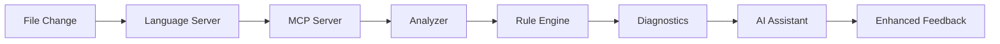

# MCP Code Analysis Server Design

## Overview

An MCP (Model Context Protocol) server that provides comprehensive code analysis capabilities to AI assistants, enabling real-time code quality feedback, pattern detection, and architectural insights across any codebase.

## Architecture

### Core Components

```
mcp-code-analysis/
├── src/
│   ├── server.ts              # MCP server implementation
│   ├── analyzers/             # Language-specific analyzers
│   │   ├── base.ts            # Base analyzer interface
│   │   ├── typescript.ts      # TypeScript/JavaScript analyzer
│   │   ├── csharp.ts          # C# analyzer (using Roslyn)
│   │   ├── python.ts          # Python analyzer
│   │   └── java.ts            # Java analyzer
│   ├── tools/                 # MCP tool implementations
│   │   ├── analyze.ts         # Code analysis tool
│   │   ├── findPatterns.ts    # Pattern detection tool
│   │   ├── checkSecurity.ts   # Security scanning tool
│   │   ├── suggest.ts         # Fix suggestion tool
│   │   └── architecture.ts    # Architecture analysis tool
│   ├── resources/             # MCP resource providers
│   │   ├── diagnostics.ts     # Current diagnostics resource
│   │   ├── metrics.ts         # Code metrics resource
│   │   └── patterns.ts        # Detected patterns resource
│   └── config/
│       └── rules/             # Configurable analysis rules
├── package.json
└── README.md
```

### MCP Tools Specification

#### 1. analyze
```typescript
{
  name: "analyze",
  description: "Analyze code for issues, patterns, and improvements",
  inputSchema: {
    type: "object",
    properties: {
      path: { type: "string", description: "File or directory path" },
      language: { type: "string", description: "Programming language" },
      rules: { type: "array", items: { type: "string" } },
      depth: { type: "string", enum: ["quick", "standard", "deep"] }
    },
    required: ["path"]
  }
}
```

#### 2. findPatterns
```typescript
{
  name: "findPatterns",
  description: "Find code patterns, anti-patterns, or similar code",
  inputSchema: {
    type: "object",
    properties: {
      pattern: { type: "string", description: "Pattern to search for" },
      scope: { type: "string", enum: ["file", "project", "workspace"] },
      includeVariations: { type: "boolean" }
    },
    required: ["pattern"]
  }
}
```

#### 3. checkSecurity
```typescript
{
  name: "checkSecurity",
  description: "Scan for security vulnerabilities",
  inputSchema: {
    type: "object",
    properties: {
      path: { type: "string" },
      checks: { 
        type: "array", 
        items: { 
          type: "string",
          enum: ["secrets", "injection", "xss", "auth", "crypto", "all"]
        }
      }
    },
    required: ["path"]
  }
}
```

#### 4. suggest
```typescript
{
  name: "suggest",
  description: "Suggest fixes for identified issues",
  inputSchema: {
    type: "object",
    properties: {
      issueId: { type: "string", description: "ID of the issue" },
      context: { type: "boolean", description: "Include surrounding code" },
      multiple: { type: "boolean", description: "Generate multiple suggestions" }
    },
    required: ["issueId"]
  }
}
```

#### 5. architecture
```typescript
{
  name: "architecture",
  description: "Analyze system architecture and dependencies",
  inputSchema: {
    type: "object",
    properties: {
      component: { type: "string", description: "Component to analyze" },
      checks: {
        type: "array",
        items: {
          type: "string",
          enum: ["layers", "dependencies", "coupling", "cohesion", "patterns"]
        }
      }
    }
  }
}
```

### MCP Resources

#### 1. diagnostics://current
```typescript
{
  uri: "diagnostics://current",
  name: "Current Diagnostics",
  description: "Real-time code diagnostics",
  mimeType: "application/json"
}

// Returns:
{
  "diagnostics": [
    {
      "id": "CA001",
      "severity": "error",
      "message": "Use decimal for monetary values",
      "file": "TradingService.cs",
      "line": 42,
      "column": 15,
      "rule": "FinancialPrecision"
    }
  ],
  "summary": {
    "errors": 5,
    "warnings": 12,
    "info": 23
  }
}
```

#### 2. metrics://project
```typescript
{
  uri: "metrics://project",
  name: "Code Metrics",
  description: "Project-wide code quality metrics",
  mimeType: "application/json"
}

// Returns:
{
  "metrics": {
    "complexity": {
      "cyclomatic": 3.2,
      "cognitive": 4.1
    },
    "maintainability": 78,
    "testCoverage": 82,
    "duplications": 2.3,
    "technicalDebt": "3d 4h"
  }
}
```

### Integration with Language Servers

```typescript
class CSharpAnalyzer extends BaseAnalyzer {
  private roslynServer: RoslynLanguageServer;
  
  async analyze(file: string): Promise<Diagnostic[]> {
    // Use Roslyn for C# analysis
    const diagnostics = await this.roslynServer.getDiagnostics(file);
    
    // Enhance with custom rules
    const customDiagnostics = await this.runCustomRules(file);
    
    // Merge and prioritize
    return this.mergeDiagnostics(diagnostics, customDiagnostics);
  }
}
```

### Real-time Analysis Pipeline



### Configuration

```json
{
  "mcp-code-analysis": {
    "languages": {
      "csharp": {
        "enabled": true,
        "analyzer": "roslyn",
        "rules": ["financial-precision", "canonical-patterns", "performance"]
      },
      "typescript": {
        "enabled": true,
        "analyzer": "typescript-language-server",
        "rules": ["no-any", "strict-null-checks"]
      }
    },
    "realtime": {
      "enabled": true,
      "debounce": 500,
      "maxDiagnostics": 100
    },
    "security": {
      "scanOnSave": true,
      "secretPatterns": "./config/secrets.json"
    }
  }
}
```

### Example Usage in AI Context

```markdown
Human: Analyze this file for issues