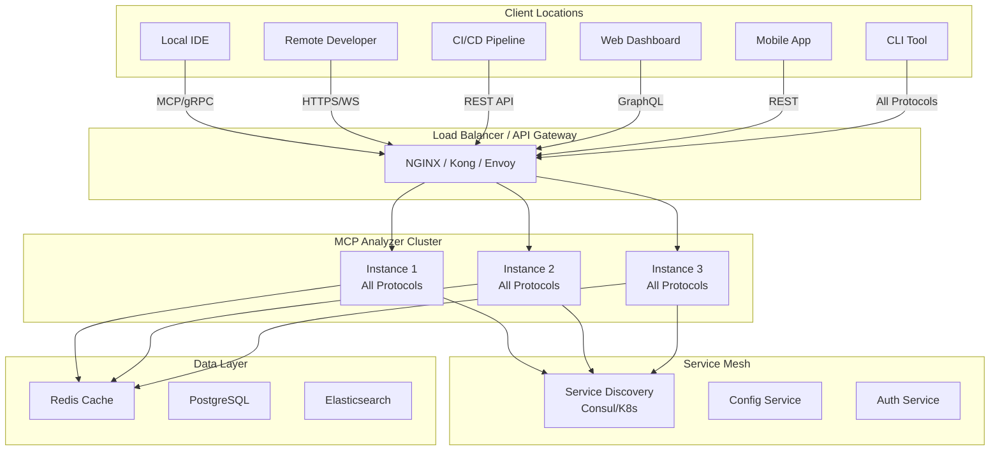

# MCP Code Analysis Server - Remote Accessibility Architecture

## Multi-Protocol Communication Layer

### 1. Core Server Architecture

```typescript
interface IRemoteAccessibleServer {
  // Multiple protocol support
  protocols: {
    mcp: MCPServer;           // Native MCP protocol
    http: HTTPServer;         // REST API
    websocket: WebSocketServer; // Real-time updates
    grpc: GRPCServer;         // High-performance RPC
    graphql: GraphQLServer;   // Flexible queries
    tcp: TCPServer;           // Raw TCP for custom protocols
  };
  
  // Authentication & Security
  auth: IAuthenticationService;
  tls: ITLSConfiguration;
  rateLimit: IRateLimiter;
  
  // Service Discovery
  discovery: IServiceDiscovery;
  healthCheck: IHealthCheckEndpoint;
}

class RemoteAccessibleMCPServer {
  private readonly config: ServerConfig;
  private readonly protocols: Map<string, IProtocolServer> = new Map();
  
  async start() {
    // Start all protocol servers
    await this.startMCPServer();      // Port 3333
    await this.startHTTPServer();     // Port 8080
    await this.startWebSocketServer(); // Port 8081
    await this.startGRPCServer();     // Port 50051
    await this.startGraphQLServer();  // Port 4000
    
    // Register with service discovery
    await this.registerService();
    
    // Start health check endpoint
    await this.startHealthCheck();
  }
}
```

### 2. REST API Endpoints

```typescript
// RESTful API for universal access
class HTTPAPIServer {
  private app: Express;
  
  setupRoutes() {
    // Analysis endpoints
    this.app.post('/api/v1/analyze', this.handleAnalyze);
    this.app.post('/api/v1/analyze/file', this.handleAnalyzeFile);
    this.app.post('/api/v1/analyze/project', this.handleAnalyzeProject);
    
    // Real-time analysis
    this.app.ws('/api/v1/stream', this.handleWebSocketConnection);
    
    // Batch operations
    this.app.post('/api/v1/batch/analyze', this.handleBatchAnalyze);
    
    // Results and reporting
    this.app.get('/api/v1/results/:id', this.handleGetResults);
    this.app.get('/api/v1/reports/:projectId', this.handleGetReport);
    
    // Configuration
    this.app.get('/api/v1/rules', this.handleGetRules);
    this.app.post('/api/v1/rules/custom', this.handleAddCustomRule);
    
    // Health and metrics
    this.app.get('/health', this.handleHealthCheck);
    this.app.get('/metrics', this.handleMetrics);
  }
  
  // OpenAPI specification
  generateOpenAPISpec(): OpenAPISpec {
    return {
      openapi: "3.0.0",
      info: {
        title: "MCP Code Analysis API",
        version: "1.0.0",
        description: "Remote code analysis service"
      },
      servers: [
        { url: "https://api.mcp-analyzer.com" },
        { url: "http://localhost:8080" }
      ],
      paths: {
        "/api/v1/analyze": {
          post: {
            summary: "Analyze code snippet",
            requestBody: {
              content: {
                "application/json": {
                  schema: {
                    type: "object",
                    properties: {
                      code: { type: "string" },
                      language: { type: "string" },
                      rules: { type: "array", items: { type: "string" } }
                    }
                  }
                }
              }
            },
            responses: {
              200: {
                description: "Analysis results",
                content: {
                  "application/json": {
                    schema: { $ref: "#/components/schemas/AnalysisResult" }
                  }
                }
              }
            }
          }
        }
      }
    };
  }
}
```

### 3. WebSocket for Real-Time Updates

```typescript
interface IWebSocketProtocol {
  // Connection management
  onConnect(client: WebSocketClient): void;
  onDisconnect(client: WebSocketClient): void;
  
  // Real-time analysis
  subscribeToFile(client: WebSocketClient, filePath: string): void;
  subscribeToProject(client: WebSocketClient, projectId: string): void;
  
  // Bidirectional communication
  onMessage(client: WebSocketClient, message: Message): void;
  broadcast(event: AnalysisEvent): void;
}

class WebSocketServer {
  private wss: WebSocket.Server;
  private clients: Map<string, WebSocketClient> = new Map();
  
  constructor(port: number) {
    this.wss = new WebSocket.Server({ port });
    
    this.wss.on('connection', (ws, req) => {
      const client = this.authenticateClient(req);
      
      ws.on('message', (data) => {
        const message = JSON.parse(data.toString());
        
        switch (message.type) {
          case 'subscribe':
            this.handleSubscribe(client, message);
            break;
          case 'analyze':
            this.handleAnalyzeRequest(client, message);
            break;
          case 'configure':
            this.handleConfigure(client, message);
            break;
        }
      });
      
      // Send real-time updates
      this.analyzer.on('diagnostic', (diagnostic) => {
        if (this.shouldSendToClient(client, diagnostic)) {
          ws.send(JSON.stringify({
            type: 'diagnostic',
            data: diagnostic
          }));
        }
      });
    });
  }
}
```

### 4. gRPC for High-Performance Communication

```protobuf
// analyzer.proto
syntax = "proto3";

package mcp.analyzer;

service CodeAnalyzer {
  // Unary RPC
  rpc Analyze(AnalyzeRequest) returns (AnalyzeResponse);
  
  // Server streaming for real-time results
  rpc AnalyzeStream(AnalyzeRequest) returns (stream DiagnosticEvent);
  
  // Bidirectional streaming
  rpc InteractiveAnalysis(stream AnalysisCommand) returns (stream AnalysisEvent);
  
  // Batch operations
  rpc BatchAnalyze(BatchAnalyzeRequest) returns (BatchAnalyzeResponse);
}

message AnalyzeRequest {
  oneof source {
    string code = 1;
    string file_path = 2;
    string project_id = 3;
  }
  string language = 4;
  repeated string rules = 5;
  AnalysisOptions options = 6;
}

message DiagnosticEvent {
  string id = 1;
  DiagnosticSeverity severity = 2;
  string message = 3;
  Location location = 4;
  string rule_id = 5;
  map<string, string> properties = 6;
}
```

```typescript
// gRPC server implementation
class GRPCAnalyzerServer {
  private server: grpc.Server;
  
  constructor() {
    this.server = new grpc.Server();
    
    this.server.addService(CodeAnalyzerService, {
      analyze: this.analyze.bind(this),
      analyzeStream: this.analyzeStream.bind(this),
      interactiveAnalysis: this.interactiveAnalysis.bind(this),
      batchAnalyze: this.batchAnalyze.bind(this)
    });
  }
  
  async analyzeStream(call: ServerWritableStream) {
    const request = call.request;
    
    // Stream results as they're found
    this.analyzer.on('diagnostic', (diagnostic) => {
      call.write({
        id: diagnostic.id,
        severity: diagnostic.severity,
        message: diagnostic.message,
        location: diagnostic.location,
        ruleId: diagnostic.ruleId
      });
    });
    
    await this.analyzer.analyze(request);
    call.end();
  }
}
```

### 5. GraphQL for Flexible Queries

```graphql
# schema.graphql
type Query {
  # Analysis queries
  analyze(input: AnalysisInput!): AnalysisResult!
  getResults(id: ID!): AnalysisResult
  
  # Project queries
  project(id: ID!): Project
  projects(filter: ProjectFilter): [Project!]!
  
  # Rule queries
  rules(category: String): [Rule!]!
  rule(id: ID!): Rule
  
  # Metrics
  metrics(projectId: ID!, timeRange: TimeRange): Metrics!
}

type Mutation {
  # Start analysis
  startAnalysis(input: AnalysisInput!): AnalysisJob!
  
  # Configuration
  addCustomRule(rule: CustomRuleInput!): Rule!
  updateConfiguration(config: ConfigInput!): Configuration!
  
  # Project management
  createProject(input: ProjectInput!): Project!
  updateProject(id: ID!, input: ProjectInput!): Project!
}

type Subscription {
  # Real-time diagnostics
  diagnostics(projectId: ID!): DiagnosticEvent!
  
  # Analysis progress
  analysisProgress(jobId: ID!): ProgressEvent!
  
  # Metrics updates
  metricsUpdate(projectId: ID!): MetricsEvent!
}

type AnalysisResult {
  id: ID!
  diagnostics: [Diagnostic!]!
  metrics: Metrics!
  summary: Summary!
  timestamp: DateTime!
}
```

### 6. Authentication & Authorization

```typescript
interface IAuthenticationService {
  // Multiple auth methods
  authenticateAPIKey(key: string): Promise<AuthContext>;
  authenticateJWT(token: string): Promise<AuthContext>;
  authenticateOAuth(token: string): Promise<AuthContext>;
  authenticateCertificate(cert: Certificate): Promise<AuthContext>;
  
  // Authorization
  authorize(context: AuthContext, resource: string, action: string): boolean;
  
  // Multi-tenancy
  getTenant(context: AuthContext): Tenant;
}

class SecurityMiddleware {
  // API Key authentication
  async authenticateAPIKey(req: Request): Promise<AuthContext> {
    const apiKey = req.headers['x-api-key'];
    if (!apiKey) throw new UnauthorizedError();
    
    const keyData = await this.keyStore.validate(apiKey);
    return {
      userId: keyData.userId,
      tenantId: keyData.tenantId,
      permissions: keyData.permissions,
      rateLimit: keyData.rateLimit
    };
  }
  
  // JWT authentication
  async authenticateJWT(req: Request): Promise<AuthContext> {
    const token = this.extractBearerToken(req);
    const payload = await this.verifyJWT(token);
    
    return {
      userId: payload.sub,
      tenantId: payload.tenant,
      permissions: payload.permissions,
      expiresAt: payload.exp
    };
  }
  
  // mTLS authentication
  async authenticateCertificate(req: Request): Promise<AuthContext> {
    const cert = req.connection.getPeerCertificate();
    if (!cert || !this.validateCertificate(cert)) {
      throw new UnauthorizedError();
    }
    
    return {
      userId: cert.subject.CN,
      tenantId: cert.subject.O,
      permissions: this.getCertPermissions(cert)
    };
  }
}
```

### 7. Service Discovery & Load Balancing

```typescript
interface IServiceDiscovery {
  // Registration
  register(service: ServiceInfo): Promise<void>;
  deregister(serviceId: string): Promise<void>;
  
  // Discovery
  discover(serviceName: string): Promise<ServiceInstance[]>;
  watchService(serviceName: string, callback: ServiceCallback): void;
  
  // Health checks
  reportHealth(status: HealthStatus): Promise<void>;
}

class ServiceRegistry {
  // Consul integration
  private consul: Consul;
  
  async register() {
    await this.consul.agent.service.register({
      name: 'mcp-code-analyzer',
      id: `mcp-analyzer-${this.instanceId}`,
      address: this.config.publicIp,
      port: this.config.port,
      tags: ['code-analysis', 'mcp', 'v1'],
      check: {
        http: `http://${this.config.publicIp}:${this.config.port}/health`,
        interval: '10s',
        timeout: '5s'
      },
      meta: {
        version: this.version,
        protocols: 'mcp,http,websocket,grpc',
        languages: 'typescript,csharp,python,java,go'
      }
    });
  }
  
  // Kubernetes service discovery
  async registerK8s() {
    // Automatically handled by K8s Service
    // But we can add custom annotations
    const service = {
      apiVersion: 'v1',
      kind: 'Service',
      metadata: {
        name: 'mcp-analyzer',
        annotations: {
          'mcp.analyzer/version': this.version,
          'mcp.analyzer/protocols': 'mcp,http,ws,grpc'
        }
      },
      spec: {
        selector: { app: 'mcp-analyzer' },
        ports: [
          { name: 'mcp', port: 3333 },
          { name: 'http', port: 8080 },
          { name: 'websocket', port: 8081 },
          { name: 'grpc', port: 50051 }
        ]
      }
    };
  }
}
```

### 8. Client Libraries for Multiple Languages

```typescript
// TypeScript/JavaScript client
class MCPAnalyzerClient {
  constructor(private config: ClientConfig) {}
  
  async analyze(code: string, options?: AnalysisOptions): Promise<AnalysisResult> {
    return this.transport.request('analyze', { code, options });
  }
  
  subscribe(projectId: string, callback: DiagnosticCallback): Subscription {
    return this.transport.subscribe(`project:${projectId}`, callback);
  }
}

// Python client
# mcp_analyzer_client.py
class MCPAnalyzerClient:
    def __init__(self, host="localhost", port=8080, protocol="http"):
        self.base_url = f"{protocol}://{host}:{port}"
        self.session = aiohttp.ClientSession()
    
    async def analyze(self, code: str, language: str = "python") -> AnalysisResult:
        async with self.session.post(
            f"{self.base_url}/api/v1/analyze",
            json={"code": code, "language": language}
        ) as response:
            return AnalysisResult.from_json(await response.json())
    
    async def stream_diagnostics(self, project_id: str):
        async with self.session.ws_connect(
            f"{self.base_url}/ws/projects/{project_id}"
        ) as ws:
            async for msg in ws:
                yield Diagnostic.from_json(msg.json())

// C# client
public class MCPAnalyzerClient
{
    private readonly HttpClient _httpClient;
    private readonly GrpcChannel _grpcChannel;
    
    public MCPAnalyzerClient(string endpoint)
    {
        _httpClient = new HttpClient { BaseAddress = new Uri(endpoint) };
        _grpcChannel = GrpcChannel.ForAddress(endpoint);
    }
    
    public async Task<AnalysisResult> AnalyzeAsync(string code, string language)
    {
        var response = await _httpClient.PostAsJsonAsync("/api/v1/analyze", new
        {
            code,
            language
        });
        
        return await response.Content.ReadFromJsonAsync<AnalysisResult>();
    }
    
    public async IAsyncEnumerable<Diagnostic> StreamDiagnosticsAsync(string projectId)
    {
        var client = new CodeAnalyzer.CodeAnalyzerClient(_grpcChannel);
        var stream = client.AnalyzeStream(new AnalyzeRequest { ProjectId = projectId });
        
        await foreach (var diagnostic in stream.ResponseStream.ReadAllAsync())
        {
            yield return diagnostic;
        }
    }
}
```

### 9. Deployment Options

```yaml
# docker-compose.yml
version: '3.8'

services:
  mcp-analyzer:
    image: mcp-analyzer:latest
    ports:
      - "3333:3333"   # MCP
      - "8080:8080"   # HTTP
      - "8081:8081"   # WebSocket
      - "50051:50051" # gRPC
      - "4000:4000"   # GraphQL
    environment:
      - NODE_ENV=production
      - AUTH_ENABLED=true
      - TLS_ENABLED=true
      - RATE_LIMIT_ENABLED=true
    volumes:
      - ./config:/app/config
      - ./plugins:/app/plugins
    deploy:
      replicas: 3
      resources:
        limits:
          cpus: '2'
          memory: 4G

  nginx:
    image: nginx:alpine
    ports:
      - "443:443"
    volumes:
      - ./nginx.conf:/etc/nginx/nginx.conf
      - ./certs:/etc/nginx/certs
    depends_on:
      - mcp-analyzer
```

```yaml
# kubernetes-deployment.yaml
apiVersion: apps/v1
kind: Deployment
metadata:
  name: mcp-analyzer
spec:
  replicas: 3
  selector:
    matchLabels:
      app: mcp-analyzer
  template:
    metadata:
      labels:
        app: mcp-analyzer
    spec:
      containers:
      - name: analyzer
        image: mcp-analyzer:latest
        ports:
        - containerPort: 3333
          name: mcp
        - containerPort: 8080
          name: http
        - containerPort: 8081
          name: websocket
        - containerPort: 50051
          name: grpc
        env:
        - name: CLUSTER_MODE
          value: "true"
        resources:
          requests:
            memory: "1Gi"
            cpu: "500m"
          limits:
            memory: "4Gi"
            cpu: "2000m"
---
apiVersion: v1
kind: Service
metadata:
  name: mcp-analyzer
  annotations:
    service.beta.kubernetes.io/aws-load-balancer-type: "nlb"
spec:
  type: LoadBalancer
  selector:
    app: mcp-analyzer
  ports:
  - name: mcp
    port: 3333
  - name: http
    port: 8080
  - name: websocket
    port: 8081
  - name: grpc
    port: 50051
```

### 10. Remote Agent Architecture

```typescript
// Lightweight agent for remote machines
class MCPAnalyzerAgent {
  private connection: RemoteConnection;
  private fileWatcher: FileWatcher;
  private cache: LocalCache;
  
  async connect(serverUrl: string, credentials: Credentials) {
    this.connection = await this.establishConnection(serverUrl, credentials);
    
    // Start file watching
    this.fileWatcher.on('change', async (file) => {
      // Send incremental updates only
      const diff = await this.calculateDiff(file);
      await this.connection.send('file:changed', { file, diff });
    });
    
    // Receive analysis results
    this.connection.on('diagnostics', (diagnostics) => {
      this.applyToLocalIDE(diagnostics);
    });
  }
  
  // Minimal footprint - most processing on server
  async analyzeLocally(file: string) {
    const content = await this.readFile(file);
    const hash = this.calculateHash(content);
    
    // Check cache first
    if (this.cache.has(hash)) {
      return this.cache.get(hash);
    }
    
    // Send to remote server
    const result = await this.connection.request('analyze', {
      content,
      hash,
      metadata: this.getFileMetadata(file)
    });
    
    this.cache.set(hash, result);
    return result;
  }
}
```

## Network Architecture Diagram



This architecture ensures the MCP Code Analysis Server is:

1. **Accessible from anywhere** via multiple protocols
2. **Scalable** with clustering and load balancing
3. **Secure** with multiple authentication methods
4. **Performant** with caching and optimized protocols
5. **Reliable** with health checks and service discovery
6. **Easy to integrate** with client libraries for all major languages
7. **Flexible** supporting various deployment options (Docker, K8s, bare metal)