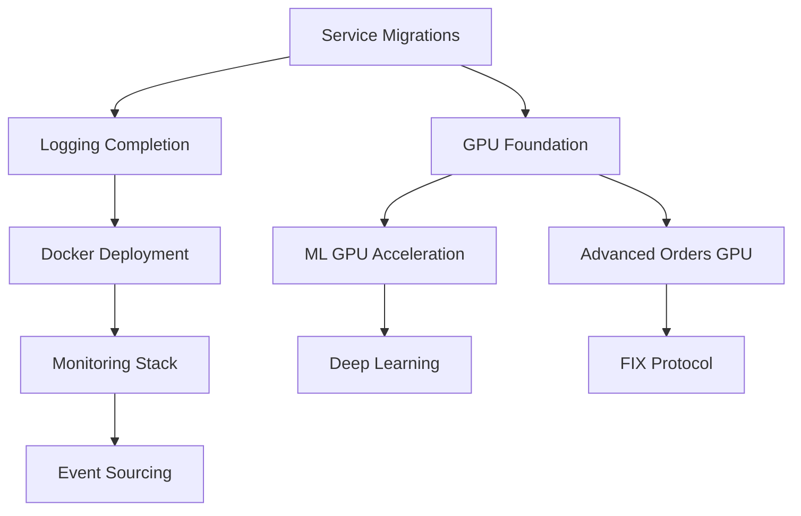

# 🎯 Unified Master TODO List - Day Trading Platform (Single-User System)

**Last Updated**: 2025-07-06  
**Context**: Single-user deployment in closed environment  
**Overall Progress**: ~75% complete

## 🚨 Priority Framework

For a single-user trading system, priorities are:
1. **P0 (Critical)**: Core functionality completion & GPU performance
2. **P1 (High)**: Local deployment & monitoring excellence  
3. **P2 (Medium)**: Advanced features & optimizations
4. **P3 (Low)**: Nice-to-have enhancements

## 📋 Master Task List (Prioritized)

### 🚧 Currently In Progress

1. **Enhance TradingLogOrchestrator: Add SCREAMING_SNAKE_CASE event codes** (P0)
   - Status: IN PROGRESS 🚧
   - Location: TradingLogOrchestratorEnhanced.cs created
   - Next: Complete operation tracking and child logger support

### 🔴 P0 - Critical Tasks (Complete Core Functionality First)

#### Core Service Migrations (Week 1-2)
2. **Migrate OrderExecutionEngine to CanonicalExecutionService** 
   - Critical for consistent error handling and logging
   - Enables GPU acceleration hooks
   
3. **Migrate PortfolioManager to CanonicalPortfolioService**
   - Required for proper lifecycle management
   - Foundation for real-time portfolio analytics

4. **Migrate StrategyManager to CanonicalStrategyService**
   - Enables strategy performance tracking
   - Required for ML strategy optimization

#### Logging & Observability Completion (Week 2)
5. **Complete TradingLogOrchestrator enhancements**
   - Implement operation tracking (start/complete/failed)
   - Add child logger support
   - Update all canonical base classes with automatic method logging

#### GPU Acceleration Foundation (Week 3-4)
6. **Implement CUDA kernels for core financial calculations**
   - VaR/CVaR calculations (100x speedup potential)
   - Monte Carlo simulations
   - Portfolio optimization matrices
   - Technical indicator calculations

7. **Integrate GPU-accelerated DecimalMath operations**
   - Custom CUDA kernels for decimal arithmetic
   - Maintain financial precision with GPU performance

### 🟡 P1 - High Priority Tasks (Performance & Deployment)

#### ML/AI GPU Enhancement (Week 5-6)
8. **Implement TensorRT for ML model inference**
   - Convert existing ML.NET models
   - Add GPU inference pipeline
   - Real-time prediction acceleration

9. **Add RAPIDS for GPU-accelerated data processing**
   - DataFrame operations on GPU
   - Time-series analysis acceleration
   - Feature engineering pipeline

#### Local Deployment Excellence (Week 7-8)
10. **Create Docker containers with GPU support**
    - Multi-stage builds for optimization
    - NVIDIA Container Toolkit integration
    - One-click deployment scripts

11. **Set up local monitoring stack**
    - Grafana dashboards for trading metrics
    - Prometheus with custom exporters
    - GPU utilization monitoring

#### Advanced Order Types (Week 9)
12. **Implement advanced order types with GPU acceleration**
    - TWAP (Time-Weighted Average Price)
    - VWAP (Volume-Weighted Average Price)  
    - Iceberg orders
    - GPU-optimized execution algorithms

### 🟢 P2 - Medium Priority Tasks (Advanced Features)

#### Event Sourcing & Audit (Week 10)
13. **Implement EventStore for complete audit trail**
    - All trading events persisted
    - Event replay capability
    - Personal compliance records

14. **Add CQRS for read/write optimization**
    - Separate command and query models
    - Optimized read models for analytics

#### FIX Protocol (Week 11)
15. **Complete FIX protocol implementation**
    - Direct market connectivity
    - Low-latency order routing
    - FIX session management

#### Deep Learning Models (Week 12)
16. **Implement advanced deep learning models**
    - LSTM for time-series prediction
    - Transformer models for pattern recognition
    - Reinforcement learning for strategy optimization

### 🔵 P3 - Low Priority Tasks (Nice-to-Have)

17. **Add AutoML capabilities**
    - Automated strategy discovery
    - Hyperparameter optimization
    - Model selection automation

18. **Implement real-time anomaly detection**
    - Market manipulation detection
    - Unusual pattern identification
    - Risk alerts

19. **Create advanced visualization dashboard**
    - Real-time P&L curves
    - Risk heat maps
    - Strategy performance analytics

20. **Add voice command integration**
    - Trade execution by voice
    - Market status queries
    - Hands-free operation

## 📊 Revised Task Categories

### 🚀 GPU Acceleration & Performance
- CUDA kernel implementation (P0)
- TensorRT integration (P1)
- RAPIDS data processing (P1)
- GPU-accelerated order types (P1)

### 🔧 Core Infrastructure Completion
- Service migrations to canonical (P0)
- Logging enhancements (P0)
- Docker deployment (P1)
- Event sourcing (P2)

### 🤖 AI/ML Enhancement  
- GPU inference acceleration (P1)
- Deep learning models (P2)
- AutoML capabilities (P3)
- Anomaly detection (P3)

### 📈 Trading Features
- Advanced order types (P1)
- FIX protocol (P2)
- Voice commands (P3)

### 📊 Monitoring & Analytics
- Local Grafana stack (P1)
- GPU monitoring (P1)
- Advanced dashboards (P3)

## ⏱️ Estimated Timeline

**Total Duration**: 12 weeks for all tasks

- **Weeks 1-4**: P0 tasks (Core completion + GPU foundation)
- **Weeks 5-8**: P1 tasks (Performance + deployment)
- **Weeks 9-11**: P2 tasks (Advanced features)
- **Week 12**: P3 tasks (Nice-to-have)

## 🎯 Success Criteria

### Performance Targets (with GPU)
- Order execution: < 100 microseconds
- Risk calculations: < 10ms for full portfolio
- ML inference: < 1ms per prediction
- Data processing: 1M+ records/second

### Functionality Targets
- All core services migrated to canonical patterns
- Complete observability with Grafana dashboards
- GPU acceleration for all compute-intensive operations
- One-click Docker deployment

## 📝 Implementation Notes

1. **GPU First**: Every compute-intensive operation should consider GPU acceleration
2. **Local Optimization**: Optimize for single high-performance workstation
3. **Simplicity**: Avoid distributed system complexity (no K8s, service mesh)
4. **Performance**: Target microsecond latencies where possible
5. **Monitoring**: Rich local dashboards over complex distributed tracing

## 🔄 Task Dependencies

## 📋 Daily Checklist

When working on tasks:
- [ ] GPU optimization considered?
- [ ] Performance benchmarked?
- [ ] Local deployment tested?
- [ ] Monitoring metrics added?
- [ ] Tests written and passing?

---

*This unified list combines existing development tasks with architectural improvements, prioritized specifically for a single-user, high-performance trading system.*