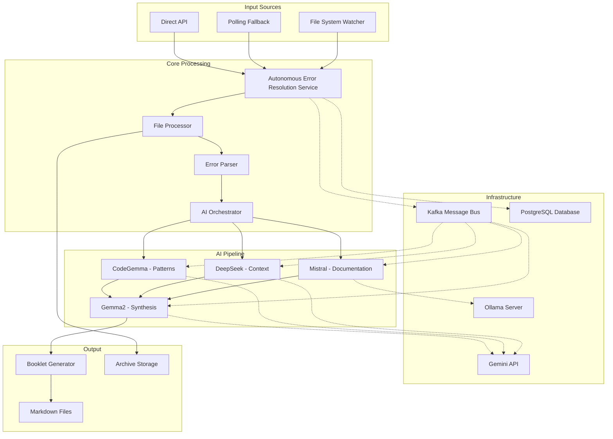

# AIRES System Architecture

**Version**: 3.0  
**Last Updated**: 2025-01-13  
**Author**: tradingagent  
**Status**: Production-Ready Autonomous System

## Table of Contents

1. [System Overview](#system-overview)
2. [Architecture Principles](#architecture-principles)
3. [High-Level Architecture](#high-level-architecture)
4. [Domain Model](#domain-model)
5. [Infrastructure Components](#infrastructure-components)
6. [Data Flow](#data-flow)
7. [Deployment Architecture](#deployment-architecture)
8. [Security Architecture](#security-architecture)

## System Overview

AIRES (AI Error Resolution System) is an autonomous system designed to prevent the "compiler trap" - the dangerous cycle where developers fix compilation errors individually without understanding root causes, leading to architectural drift and technical debt.

### Key Capabilities

- **Autonomous Operation**: Monitors for build errors 24/7 without human intervention
- **Multi-AI Analysis**: Leverages 4 specialized AI models for comprehensive error analysis
- **Research-First Approach**: Forces understanding before allowing fixes
- **Production-Grade**: Includes health monitoring, retry logic, and scalability features
- **Knowledge Preservation**: Creates searchable documentation from every error analysis

### System Goals

1. **Prevent Quick Fixes**: Eliminate superficial error resolution
2. **Enforce Understanding**: Require booklet reading before code changes
3. **Preserve Knowledge**: Build a searchable library of error solutions
4. **Maintain Quality**: Ensure all fixes align with architectural standards

## Architecture Principles

### 1. Domain-Driven Design (DDD)

AIRES follows strict DDD principles:
- **Bounded Contexts**: Clear separation between error analysis and code modification
- **Aggregates**: ErrorBatch and ResearchBooklet enforce business rules
- **Value Objects**: Immutable data carriers for errors and findings
- **Domain Services**: Encapsulate complex business logic

### 2. Hexagonal Architecture

```
┌─────────────────────────────────────────────────────────┐
│                    Presentation Layer                    │
│                  (Console Application)                   │
├─────────────────────────────────────────────────────────┤
│                   Application Services                   │
│         (AutonomousErrorResolutionService)              │
├─────────────────────────────────────────────────────────┤
│                      Domain Layer                        │
│    (ErrorBatch, ResearchBooklet, Domain Services)       │
├─────────────────────────────────────────────────────────┤
│                  Infrastructure Layer                    │
│ (AI Services, Kafka, PostgreSQL, File System)           │
└─────────────────────────────────────────────────────────┘
```

### 3. Message-Driven Architecture

- **Event Sourcing**: All state changes tracked as events
- **CQRS Pattern**: Separate read and write models
- **Eventual Consistency**: Async processing with guaranteed delivery

### 4. Resilience Patterns

- **Circuit Breaker**: Protect against AI service failures
- **Retry with Backoff**: Handle transient errors gracefully
- **Bulkhead Isolation**: Prevent cascading failures
- **Timeout Detection**: Identify and recover from stuck operations

## High-Level Architecture

### System Components



### Component Responsibilities

| Component | Responsibility | Technology |
|-----------|---------------|------------|
| File System Watcher | Detect new error files | .NET FileSystemWatcher |
| Autonomous Service | Orchestrate processing | IHostedService |
| Error Parser | Extract compiler errors | Regex patterns |
| AI Orchestrator | Coordinate AI pipeline | Domain service |
| Mistral | Microsoft docs research | Ollama 7B model |
| DeepSeek | Code context analysis | API service |
| CodeGemma | Pattern validation | Gemini API |
| Gemma2 | Booklet synthesis | Gemini API |
| Kafka | Message distribution | Confluent.Kafka |
| PostgreSQL | State persistence | EF Core |

## Domain Model

### Core Aggregates

#### 1. ErrorBatch Aggregate

```csharp
public class ErrorBatch
{
    public string Id { get; private set; }
    public string SourceFile { get; private set; }
    public DateTime DetectedAt { get; private set; }
    public IReadOnlyList<CompilerError> Errors { get; private set; }
    public ProcessingStatus Status { get; private set; }
    
    // Business rules enforced at aggregate boundary
    public void AddError(CompilerError error)
    public void StartProcessing()
    public void CompleteProcessing()
}
```

#### 2. ResearchBooklet Aggregate

```csharp
public class ResearchBooklet
{
    public string Id { get; private set; }
    public string ErrorBatchId { get; private set; }
    public DateTime GeneratedAt { get; private set; }
    public BookletStatus Status { get; private set; }
    public IReadOnlyList<AIResearchFinding> Findings { get; private set; }
    
    // Lifecycle management
    public void Submit()
    public void Review(string architectId)
    public void Approve()
    public void Reject(string reason)
}
```

### Value Objects

- **CompilerError**: Immutable representation of a single error
- **ErrorLocation**: File path and line number
- **AIResearchFinding**: Base class for AI model outputs
- **ArchitecturalGuidance**: Architectural recommendations
- **ImplementationRecommendation**: Specific fix suggestions

### Domain Services

1. **ErrorParserService**: Parses build output into structured errors
2. **AIResearchOrchestratorService**: Coordinates AI pipeline execution
3. **ResearchBookletManagerService**: Manages booklet lifecycle
4. **ResearchBookletMarkdownGeneratorService**: Converts to readable format

## Infrastructure Components

### AI Integration Layer

#### 1. Mistral Documentation Service

```yaml
Purpose: Fetch and analyze Microsoft documentation
Model: mistral:7b-instruct-q4_K_M
Provider: Ollama (local)
Input: Error code and description
Output: Structured documentation findings
Temperature: 0.3 (focused, deterministic)
```

#### 2. DeepSeek Context Service

```yaml
Purpose: Analyze code context and patterns
Model: deepseek-coder:6.7b
Provider: API service
Input: Error context and affected code
Output: Technical insights and debugging approaches
Temperature: 0.5 (balanced creativity)
```

#### 3. CodeGemma Pattern Service

```yaml
Purpose: Validate against coding standards
Model: Gemini 2.5 Flash
Provider: Google Gemini API
Input: Error context and canonical patterns
Output: Pattern compliance assessment
Temperature: 0.4 (structured analysis)
```

#### 4. Gemma2 Booklet Service

```yaml
Purpose: Synthesize comprehensive booklet
Model: Gemini 2.5 Flash
Provider: Google Gemini API
Input: All AI findings
Output: Executive summary and recommendations
Temperature: 0.6 (creative synthesis)
```

### Messaging Infrastructure

#### Kafka Topics

| Topic | Purpose | Producers | Consumers |
|-------|---------|-----------|-----------|
| file-acquired-for-ai | New files ready | FileAcquisitionProducer | ErrorAnalysisService |
| ai-input-errors | Parsed errors | ErrorAnalysisService | MistralWorker |
| ai-stage1-completed | Mistral output | MistralWorker | DeepSeekWorker |
| ai-stage2-completed | DeepSeek output | DeepSeekWorker | CodeGemmaWorker |
| ai-stage3-completed | CodeGemma output | CodeGemmaWorker | Gemma2Worker |
| booklet-generation-completed | Final booklets | Gemma2Worker | BookletArchiver |

#### Message Flow

```
File Detected → Kafka → Error Parsing → Kafka → AI Pipeline → Kafka → Booklet Generation
```

### Data Persistence

#### PostgreSQL Schema

```sql
-- File processing tracking
CREATE TABLE FileProcessingRecords (
    Id UUID PRIMARY KEY,
    FileName VARCHAR(500) NOT NULL,
    FilePath VARCHAR(1000) NOT NULL,
    State INT NOT NULL,
    DetectedAt TIMESTAMP NOT NULL,
    ProcessingStartedAt TIMESTAMP,
    ProcessingCompletedAt TIMESTAMP,
    ErrorMessage TEXT,
    RetryCount INT DEFAULT 0
);

-- Reliable message delivery
CREATE TABLE OutboxMessages (
    Id UUID PRIMARY KEY,
    Topic VARCHAR(100) NOT NULL,
    Key VARCHAR(100),
    Value TEXT NOT NULL,
    CreatedAt TIMESTAMP NOT NULL,
    ProcessedAt TIMESTAMP,
    ProcessorId VARCHAR(100)
);
```

## Data Flow

### 1. File Detection Phase

```
New Error File Created
    ↓
FileSystemWatcher Event / Polling Detection
    ↓
Atomic File Acquisition (prevents duplicates)
    ↓
State: Unknown → Acquired → Detected
```

### 2. Error Parsing Phase

```
Read File Contents
    ↓
Parse Compiler Errors (Regex)
    ↓
Create ErrorBatch Aggregate
    ↓
Validate Error Format
    ↓
State: Detected → InProgress
```

### 3. AI Analysis Phase

```
Parallel Execution:
├─ Mistral: Query Microsoft Docs
├─ DeepSeek: Analyze Code Context
└─ CodeGemma: Validate Patterns
    ↓
Sequential Synthesis:
Gemma2: Combine All Findings
    ↓
Generate Executive Summary
```

### 4. Booklet Generation Phase

```
Create ResearchBooklet Aggregate
    ↓
Apply Markdown Template
    ↓
Include All AI Findings
    ↓
Save to Output Directory
    ↓
State: InProgress → Completed
```

### 5. Archive Phase

```
Move Original File to Archive/
    ↓
Update Database Records
    ↓
Clean Up Temporary Data
    ↓
State: Completed → Archived
```

## Deployment Architecture

### Container Architecture

```yaml
version: '3.8'
services:
  aires:
    image: marketanalyzer/aires:latest
    environment:
      - ASPNETCORE_ENVIRONMENT=Production
      - ConnectionStrings__DefaultConnection=Host=postgres;Database=aires
      - Kafka__BootstrapServers=kafka:9092
    depends_on:
      - postgres
      - kafka
      - ollama
    
  postgres:
    image: postgres:15
    environment:
      - POSTGRES_DB=aires
      - POSTGRES_USER=aires
      - POSTGRES_PASSWORD=${DB_PASSWORD}
    
  kafka:
    image: confluentinc/cp-kafka:latest
    environment:
      - KAFKA_ZOOKEEPER_CONNECT=zookeeper:2181
      - KAFKA_ADVERTISED_LISTENERS=PLAINTEXT://kafka:9092
    
  ollama:
    image: ollama/ollama:latest
    volumes:
      - ollama_models:/root/.ollama
```

### Scalability Considerations

1. **Horizontal Scaling**: Multiple AIRES instances can process files concurrently
2. **Kafka Partitioning**: Topics partitioned for parallel processing
3. **Database Connection Pooling**: Efficient resource utilization
4. **AI Model Caching**: Reduced latency for repeated queries

## Security Architecture

### Authentication & Authorization

- **API Keys**: Secured in environment variables
- **Database Credentials**: Encrypted at rest
- **Kafka SASL**: Secure communication between services
- **File System Permissions**: Restricted access to directories

### Data Protection

1. **In Transit**: TLS 1.3 for all external communications
2. **At Rest**: PostgreSQL transparent data encryption
3. **Secrets Management**: Azure Key Vault / HashiCorp Vault
4. **Audit Logging**: All operations tracked with correlation IDs

### Security Best Practices

- No hardcoded credentials
- Principle of least privilege
- Regular security updates
- Vulnerability scanning in CI/CD
- Input validation at all boundaries

## Monitoring & Observability

### Health Checks

```csharp
services.AddHealthChecks()
    .AddDbContextCheck<AiresDbContext>()
    .AddKafka(kafkaConfig)
    .AddUrlGroup(new Uri("http://localhost:11434"), "ollama")
    .AddUrlGroup(new Uri(geminiEndpoint), "gemini");
```

### Metrics Collection

- Processing time per file
- AI model response times
- Error rates by type
- Booklet generation success rate
- System resource utilization

### Logging Strategy

- Structured logging with Serilog
- Correlation IDs for request tracing
- Log aggregation in Seq/ELK
- Alert rules for critical errors

---

**Next**: [Core Components Documentation](../Core/AIRES_Core_Components.md)