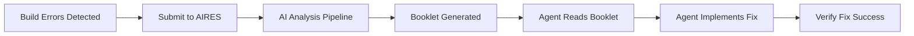

# AIRES Workflow Guide

**Version**: 3.0  
**Last Updated**: 2025-01-13  
**Author**: tradingagent  
**Status**: Complete Workflow Documentation

## Table of Contents

1. [Agent Workflow Overview](#agent-workflow-overview)
2. [Pre-Requisites](#pre-requisites)
3. [Standard Workflow](#standard-workflow)
4. [Booklet Structure](#booklet-structure)
5. [Working with Booklets](#working-with-booklets)
6. [Common Scenarios](#common-scenarios)
7. [Best Practices](#best-practices)
8. [Workflow Violations](#workflow-violations)

## Agent Workflow Overview

AIRES enforces a **research-first** approach to error resolution. This workflow is MANDATORY for all agents working with compilation errors.

### Core Principle

> **"No fixes without booklets"** - Every error must be understood through AI research before any code changes.

### Workflow Stages



## Pre-Requisites

### 1. Verify AIRES is Running

```bash
# Check AIRES process
ps aux | grep "dotnet.*BuildTools" | grep -v grep

# Expected output:
# user  12345  0.2  1.5  ... /path/to/MarketAnalyzer.BuildTools
```

If not running:
```bash
cd /mnt/d/Projects/CSharp/Day_Trading_Platform_Dragon/MarketAnalyzer/DevTools/BuildTools/src
nohup dotnet run > aires.log 2>&1 &
```

### 2. Verify Input Directory

```bash
# Check input directory exists and is writable
ls -la /mnt/d/Projects/CSharp/Day_Trading_Platform_Dragon/AI_Codebase_Watchdog_System/input/

# Should show:
# drwxrwxrwx ... input/
# drwxrwxrwx ... input/Archive/
# drwxrwxrwx ... input/Error/
```

### 3. Verify Output Directory

```bash
# Check booklet output directory
ls -la /mnt/d/Projects/CSharp/Day_Trading_Platform_Dragon/MarketAnalyzer/docs/error-booklets/

# Should contain date-based subdirectories:
# drwxrwxrwx ... 2025-01-12/
# drwxrwxrwx ... 2025-01-13/
```

## Standard Workflow

### Step 1: Capture Build Errors

```bash
# Navigate to your project
cd /path/to/your/project

# Run build and capture output
dotnet build 2>&1 | tee "build_errors_$(date +%Y%m%d_%H%M%S).txt"

# Example output file: build_errors_20250113_143022.txt
```

**Important**: The file MUST contain actual compiler errors, not just build status.

### Step 2: Submit to AIRES

```bash
# Move the error file to AIRES input directory
mv "build_errors_*.txt" /mnt/d/Projects/CSharp/Day_Trading_Platform_Dragon/AI_Codebase_Watchdog_System/input/

# AIRES will automatically detect and process the file
```

**Note**: Files in subdirectories (Archive/, Error/) are ignored by design.

### Step 3: Monitor Processing

```bash
# Watch for booklet generation (usually takes 2-5 minutes)
watch -n 5 'ls -la /mnt/d/Projects/CSharp/Day_Trading_Platform_Dragon/MarketAnalyzer/docs/error-booklets/$(date +%Y-%m-%d)/ | tail -10'

# Or check AIRES logs
tail -f aires.log | grep -E "Processing|Generated|Completed"
```

### Step 4: Read Generated Booklets

```bash
# List today's booklets
ls -la /mnt/d/Projects/CSharp/Day_Trading_Platform_Dragon/MarketAnalyzer/docs/error-booklets/$(date +%Y-%m-%d)/

# Read a specific booklet
cat /mnt/d/Projects/CSharp/Day_Trading_Platform_Dragon/MarketAnalyzer/docs/error-booklets/$(date +%Y-%m-%d)/CS0117_*.md
```

### Step 5: Implement Fixes

Based on the booklet guidance:
1. Understand the root cause
2. Review all recommendations
3. Check architectural compliance notes
4. Implement the suggested fix
5. Follow canonical patterns mentioned

### Step 6: Verify Success

```bash
# Rebuild to verify fixes
dotnet build

# If errors persist, submit new output to AIRES
# Each iteration provides deeper understanding
```

## Booklet Structure

### Standard Booklet Sections

```markdown
# Research Booklet: [Error Code]

**Generated**: [Timestamp]
**Error Batch ID**: [UUID]
**Processing Time**: [Duration]

## Executive Summary
AI-synthesized overview of the issue and recommended approach

## Compiler Errors Analyzed
Detailed breakdown of each error with context

## AI Research Findings

### 1. Error Documentation Analysis (Mistral)
- Official Microsoft documentation findings
- Common causes and solutions
- Related error codes

### 2. Code Context Analysis (DeepSeek)
- Code patterns around the error
- Contextual understanding
- Debugging approaches

### 3. Pattern Validation Results (CodeGemma)
- Canonical pattern compliance
- Architectural violations
- Best practice recommendations

### 4. Synthesis and Recommendations (Gemma2)
- Prioritized action items
- Step-by-step fix guide
- Preventive measures

## Architectural Compliance Notes
- Required patterns to follow
- Standards that must be maintained
- Technical debt considerations

## Implementation Checklist
- [ ] Understand root cause
- [ ] Review canonical patterns
- [ ] Implement recommended fix
- [ ] Verify no new violations
- [ ] Update documentation if needed
```

## Working with Booklets

### Finding Relevant Booklets

```bash
# Search by error code
find /mnt/d/Projects/CSharp/Day_Trading_Platform_Dragon/MarketAnalyzer/docs/error-booklets/ -name "*CS0117*" -type f

# Search by content
grep -r "TradingResult" /mnt/d/Projects/CSharp/Day_Trading_Platform_Dragon/MarketAnalyzer/docs/error-booklets/

# List most recent booklets
ls -lt /mnt/d/Projects/CSharp/Day_Trading_Platform_Dragon/MarketAnalyzer/docs/error-booklets/*/*.md | head -20
```

### Booklet Naming Convention

```
[ErrorCode]_[ShortDescription]_[Timestamp].md

Examples:
CS0117_Type_does_not_contain_definition_20250113_143022.md
CS1998_Async_method_lacks_await_20250113_145512.md
MSB3644_Reference_assemblies_not_found_20250113_150234.md
```

### Reading Multiple Related Booklets

When fixing multiple errors:
1. Read ALL booklets first
2. Identify common patterns
3. Fix root causes before symptoms
4. Apply fixes in logical order

## Common Scenarios

### Scenario 1: Single Error Type

```bash
# Build shows CS0246 errors
dotnet build 2>&1 | tee cs0246_errors.txt
mv cs0246_errors.txt /mnt/d/Projects/CSharp/Day_Trading_Platform_Dragon/AI_Codebase_Watchdog_System/input/

# Wait for booklet
# Read and implement fix based on guidance
```

### Scenario 2: Multiple Error Types

```bash
# Build shows various errors
dotnet build 2>&1 | tee mixed_errors.txt
mv mixed_errors.txt /mnt/d/Projects/CSharp/Day_Trading_Platform_Dragon/AI_Codebase_Watchdog_System/input/

# AIRES generates separate booklets for each error type
# Read booklets in order of dependencies
# Fix foundational errors first
```

### Scenario 3: Persistent Errors

```bash
# After first fix attempt, errors remain
dotnet build 2>&1 | tee persistent_errors.txt
mv persistent_errors.txt /mnt/d/Projects/CSharp/Day_Trading_Platform_Dragon/AI_Codebase_Watchdog_System/input/

# New booklet will have deeper analysis
# Often reveals architectural issues missed initially
```

### Scenario 4: Architecture Violations

When booklet indicates architectural violations:
1. **DO NOT** apply quick fixes
2. Review architectural standards documents
3. Refactor to align with canonical patterns
4. May require broader changes than initial error suggests

## Best Practices

### 1. Always Read Complete Booklet

❌ **Wrong**: Jump to fix section immediately  
✅ **Right**: Read executive summary, understand context, then implement

### 2. Follow Architectural Guidance

❌ **Wrong**: Fix error with minimal changes  
✅ **Right**: Ensure fix aligns with canonical patterns

### 3. Document Your Understanding

```csharp
// Based on AIRES booklet CS0117_20250113_143022
// Root cause: Missing interface implementation
// Fix: Implement ITradingService with canonical pattern
public class OrderService : CanonicalServiceBase, ITradingService
{
    // Implementation following booklet guidance
}
```

### 4. Batch Related Fixes

❌ **Wrong**: Fix errors one by one  
✅ **Right**: Group related errors, understand patterns, fix systematically

### 5. Verify Complete Resolution

```bash
# After implementing fixes
dotnet build

# If successful, document in your journal
echo "Fixed CS0117 errors using AIRES booklet guidance" >> agent_journal.md

# If errors remain, iterate through AIRES again
```

## Workflow Violations

### Critical Violations

1. **Fixing errors without booklets**
   - Consequence: Architectural drift
   - Recovery: Revert changes, use AIRES properly

2. **Ignoring architectural guidance**
   - Consequence: Technical debt accumulation
   - Recovery: Refactor following booklet recommendations

3. **Not running AIRES**
   - Consequence: Compiler trap activation
   - Recovery: Start AIRES immediately

### Warning Signs

- Fixing errors takes multiple attempts
- Similar errors keep appearing
- Quick fixes create new errors
- Architecture becomes inconsistent

### Enforcement

```bash
# Check if booklets exist for your fixes
ls -la /mnt/d/Projects/CSharp/Day_Trading_Platform_Dragon/MarketAnalyzer/docs/error-booklets/$(date +%Y-%m-%d)/

# Your fix commits should reference booklets
git commit -m "Fix CS0117 errors per AIRES booklet 20250113_143022"
```

## Advanced Workflows

### Custom Error Analysis

```bash
# For specific error investigation
echo "CS8602: Dereference of possibly null reference in OrderService.cs:42" > specific_error.txt
mv specific_error.txt /mnt/d/Projects/CSharp/Day_Trading_Platform_Dragon/AI_Codebase_Watchdog_System/input/
```

### Bulk Error Processing

```bash
# Process multiple build outputs
for file in build_output_*.txt; do
    mv "$file" /mnt/d/Projects/CSharp/Day_Trading_Platform_Dragon/AI_Codebase_Watchdog_System/input/
    echo "Submitted $file to AIRES"
    sleep 5  # Avoid overwhelming the system
done
```

### Historical Booklet Analysis

```bash
# Analyze patterns across booklets
grep -h "Root Cause" /mnt/d/Projects/CSharp/Day_Trading_Platform_Dragon/MarketAnalyzer/docs/error-booklets/*/*.md | sort | uniq -c | sort -nr

# Find most common recommendations
grep -h "Recommended Fix" /mnt/d/Projects/CSharp/Day_Trading_Platform_Dragon/MarketAnalyzer/docs/error-booklets/*/*.md | sort | uniq -c
```

---

**Next**: [Configuration Guide](AIRES_Configuration_Guide.md)