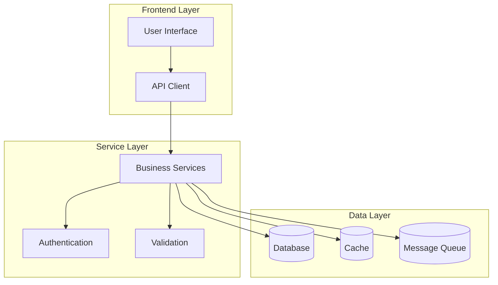
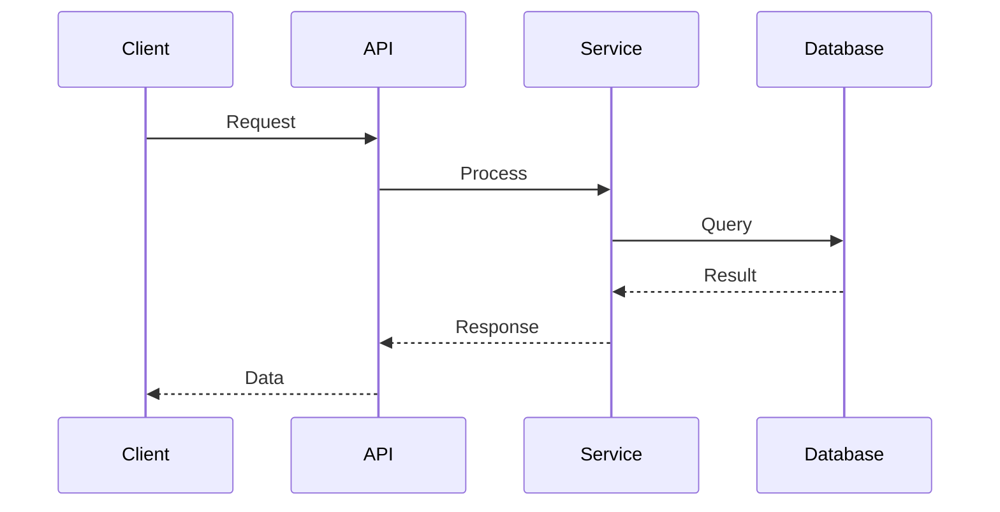

# Architecture Documentation

## System Overview

This document describes the architecture of the DayTradingPlatform system.

## High-Level Architecture

## Component Structure

## Data Flow

## Deployment Architecture

The system can be deployed in various configurations:

1. **Development**: Single machine setup
2. **Staging**: Distributed services
3. **Production**: High-availability cluster

## Security Architecture

- Authentication: JWT-based
- Authorization: Role-based access control
- Data encryption: At rest and in transit
- API security: Rate limiting and validation
