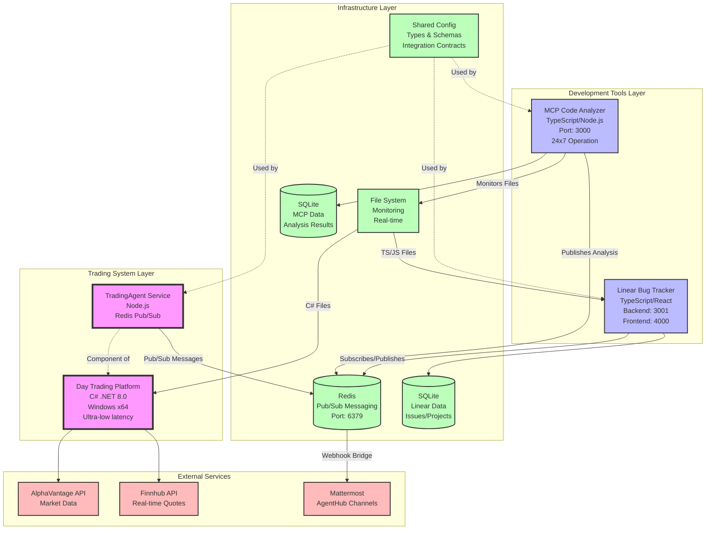

# System Architecture Overview

## Three-Project Ecosystem

This document provides a comprehensive overview of the integrated system architecture comprising:
- **Day Trading Platform** (C# .NET 8.0)
- **MCP Code Analyzer** (TypeScript/Node.js)
- **Linear Bug Tracker** (TypeScript/React)

## Architecture Diagram



## Component Details

### 1. Day Trading Platform (Core Business Application)
- **Technology**: C# .NET 8.0, Windows x64
- **Purpose**: High-performance financial trading system
- **Key Features**:
  - Ultra-low latency (<100μs targets)
  - System.Decimal for financial precision
  - Multi-monitor support (4-6 displays)
  - Rate-limited market data ingestion
  - Canonical service patterns

### 2. MCP Code Analyzer (Code Quality Guardian)
- **Technology**: TypeScript, Node.js, MCP SDK
- **Purpose**: Real-time code analysis and quality enforcement
- **Key Features**:
  - 25 specialized analysis tools
  - Financial precision validation
  - Security scanning (Trivy, Gitleaks)
  - 24x7 mandatory operation
  - Multi-language support (C#, TypeScript)

### 3. Linear Bug Tracker (Development Management)
- **Technology**: TypeScript, React, GraphQL
- **Purpose**: Multi-project issue tracking and management
- **Key Features**:
  - Full-text search capabilities
  - File attachment support
  - JWT authentication
  - PM2 for high availability
  - Auto-issue creation from MCP

### 4. TradingAgent (Communication Service)
- **Technology**: Node.js
- **Purpose**: Inter-agent communication for Trading Platform
- **Key Features**:
  - Redis pub/sub messaging
  - System-wide channel monitoring
  - AgentHub integration
  - 5-minute heartbeat

## Communication Patterns

### Redis Pub/Sub Channels
```
tradingagent:*  → Trading platform messages
mcp:*          → Code analysis results
linear:*       → Bug tracking updates
agent:*        → General agent communication
alert:*        → System-wide alerts
```

### Message Flow Examples

1. **Code Analysis Flow**:
   ```
   File Change → MCP Detects → Analysis → Redis → Linear (auto-issue) → Mattermost
   ```

2. **Trading Alert Flow**:
   ```
   Market Event → Trading Platform → TradingAgent → Redis → All Subscribers → Mattermost
   ```

3. **Bug Report Flow**:
   ```
   Linear UI → GraphQL → Backend → Redis → MCP (if needed) → Response
   ```

## Integration Points

### Shared Configuration
- Location: `/home/nader/my_projects/CS/shared-config`
- Contents: Message types, schemas, error codes, channel definitions
- Usage: NPM package for TypeScript projects, JSON references for C#

### File System Monitoring
- MCP monitors both project directories
- Real-time detection of code changes
- Automatic analysis triggers

### Database Integration
- MCP: SQLite for analysis results and metrics
- Linear: SQLite for issues, projects, and attachments
- No direct database sharing (message-based integration)

## Deployment Architecture

### Process Management
- **PM2** manages Node.js services:
  - webhook-bridge (Redis to Mattermost)
  - mcp-server
  - linear-backend
  - tradingagent (optional)

### Network Topology
- All services run on localhost (development)
- Redis on port 6379
- MCP on port 3000
- Linear backend on port 3001
- Linear frontend on port 4000

### Security Considerations
- JWT authentication for Linear
- Redis password protection (production)
- Isolated execution environments
- No direct cross-project file access

## Benefits of Separation

1. **Technology Optimization**: Each project uses optimal stack
2. **Independent Scaling**: Services scale based on individual needs
3. **Risk Isolation**: Trading platform isolated from tools
4. **Clear Boundaries**: Well-defined interfaces via messages
5. **Deployment Flexibility**: Deploy independently

## Future Enhancements

1. **Message Queue**: Add RabbitMQ for guaranteed delivery
2. **Service Mesh**: Implement for production deployments
3. **Monitoring**: Add Prometheus/Grafana stack
4. **API Gateway**: Centralize external access
5. **Container Orchestration**: Kubernetes for production

---

*Last Updated: 2025-01-30*  
*Version: 1.0*